# Bash training

## Bash

Bash is an Unix shell and command language written for the GNU Project

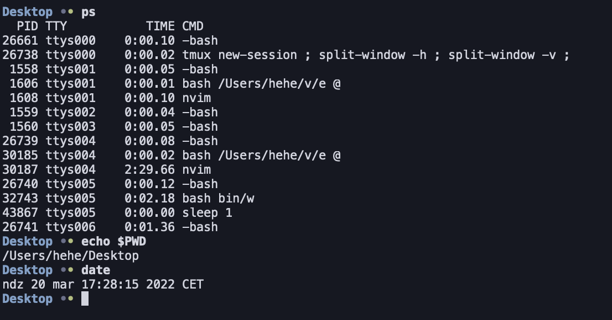

## System shell

**System shell** is a computer program, which acts as an interface
between operating system, applications and the user. Using the shell,
user can interact with the operating system e.g. **run processes**,
perform operations on files, change system settings etc.

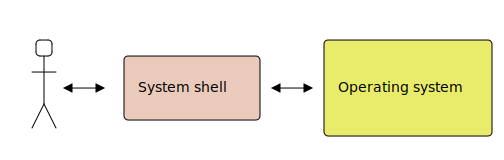

## Examples of system shells - Windows File Explorer

File Explorer is an application, which allows user to open files and run processes.
It is an example of a graphical system shell.

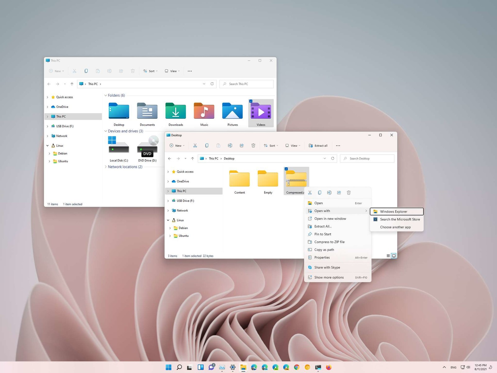

## Examples of system shells - Xbox Series X dashboard

The purpose of Xbox dashboard is to run processes (games), therefore it
can also be considered as an example of graphical system shell.


## Examples of system shells - Bash

Bash is an example of a command-line shell. Other example of command line shells
include i. a.: `zsh`, `tcsh`, `busybox ash` and `fish` shell

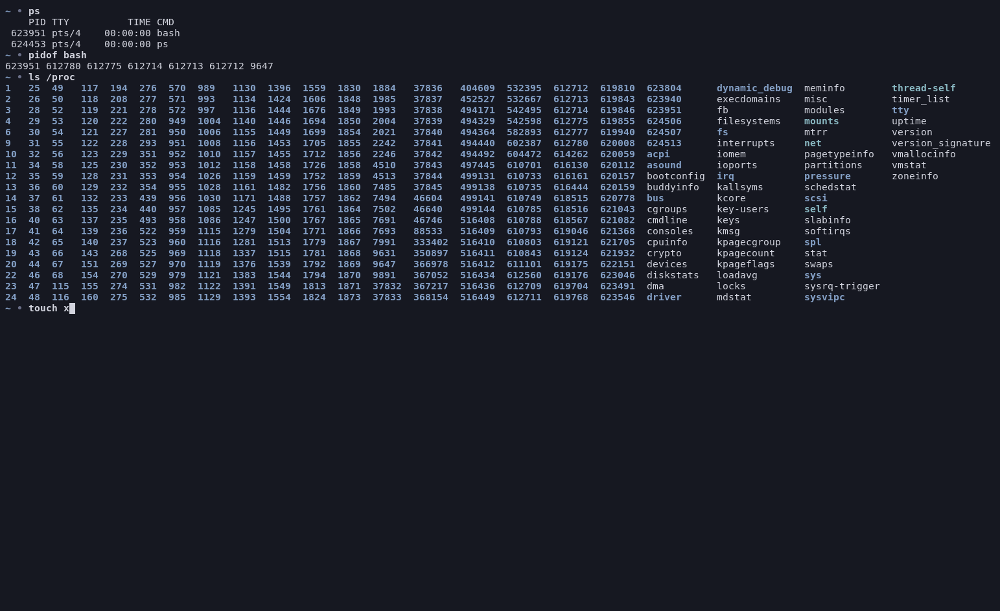

## Question: Why do we still use a command-line interface?

Why in the era of graphical user interfaces and amazing user experiences
programmers still work using the "ancient" command line interface?

- Do they want to show off?
- Are they nerds?
- Are they insane people?

## Answer: Why do we still use a command-line interface?

- **It is easier to show what you did to others**. You can send a list of
commands to the other person instead of screenshots.
- **It is natural to automate**. What you type can be placed in a text file
and you can run it again.
- **It is faster to write command line applications**. Compare `echo hello world`
with a "Hello World application" in any GUI framework.

## Running programs

Using Bash system shell we can run processes by typing program names.

```console
$ PROGRAM_NAME ARGUMENTS...
```

For example if we want to run a `ls` program, we can type:

```
$ ls -l -a /home
```

## Example programs - filesystem operations
Examples of programs that manage files and directories
```bash
$ cat p0             # print p0 to standard output
$ cat p0 p1 p2       # print p0, p1 and p2 to standard output
$ rm x               # remove file
$ rm -fr a           # remove file or directory "recursively"
$ ls d0              # print a list of files in 'd0' directory
$ ls -a d0           # print a list of files in 'd0' directory including hidden files
$ ls -l d0           # print a more detailed list of files in 'd0' directory
$ mv a b             # rename file from 'a' to 'b'
$ cp a b             # copy 'a' file to 'b'
$ cp -r a b          # copy 'a' directory to 'b' recursively
$ cp a b c d         # copy 'a', 'b', 'c' into 'd' directory
$ touch x            # change 'x' file timestamps
$ touch -c x         # change 'x' file timestamps, but do not create a file
$ mkdir a            # create directory name 'a'
$ mkdir -p a/b/c     # create 'a/b/c' directory hierarchy
$ rmdir a            # remove empty directory
$ ln a b             # create hard link named 'b' to 'a'
$ ln -s a b          # create soft link named 'b' to 'a'
```

## Example programs - access control
Examples of programs that manage file and directory permissions
```bash
$ chmod 777 f        # change 'f' permissions to 777
$ chmod u+x,g+x,o+x  # add execute permission to user, group and others
$ chown user a       # change owner of 'a' to 'user'
$ chown group:user a # change group to 'gruop' and owner of 'a' to 'user'
```

## Example programs - archive management
Examples of programs that manage archives
```bash
$ tar -tf archive.tar.gz             # print (t) files in archive (f)
$ tar -xzvf archive.tar.gz           # extract (x) .gz (z) archive, verbosely (v)
$ tar -xjvf archive.tar.bz2 -C dir   # extract (x) .bz2 (j) archive, verbosely (v) to 'dir'
$ tar -cf archive.tar f1 f2 d0       # create (c) tar archive with files (f) f1 f2 d0
$ tar -cjvpf archive.tar.bz2 f1 f2   # create bz2 (j) verbosely (v), preserving permissions (p)
$ zip x.zip f0                       # create 'x.zip' archive containing 'f0' file
$ zip -r x.zip d0                    # create 'x.zip' archive containing 'd0' directory
$ unzip x.zip                        # unzip 'x.zip'
$ unzip -l x.zip                     # print files in 'x.zip' archive
```

## Question: What is the difference between a symbolic link and a hard link?

We can create symbolic links using `ln` program:

```console
$ ln target destination
```

We can create hard links using `ln` program:
```console
$ ln -s target destination
```

What is the difference?

## Answer: What is the difference between a symbolic link and a hard link?

```
$ ln bar foo
```
```
$ ln -s bar baz
```

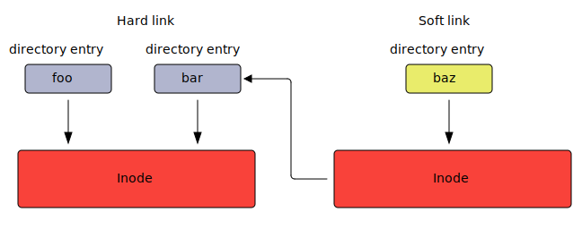

## Task: The Land of TietoEvry

Download the following archive using `wget` program:

```
$ wget czarnota.github.io/bashtraining/task-land.tar.gz
```

1. Extract the archive
2. Complete all listed missions
3. Create a `.tar.gz` archive from the directory

# Options and arguments

## Options and arguments

All characters (with the exception of a few built-in bash constructs/operators)
following the program's name are interpreted by the program and can influence
its behavior.

```console
$ PROGRAM_NAME ARGUMENTS...
```
```console
$ chmod o+w,g+w file
```
```console
$ find . \( -name words -or -name x \) -and -not -executable
```
```console
$ tcpdump -i eth0 ip or arp
```

## POSIX Syntax

Programs can parse options and arguments as they like, but there exists
a common convention that most unix programs follow. This convention is
standarised by POSIX.

In below example `-a` is an option, `-b barg` is an option with an argument `barg`
and `arg0` and `arg1` are just arguments.

```bash
$ prog -a -b barg arg0 arg1 # The 'barg' is an argument to -b option
$ prog -ab barg arg0 arg1   # You can "glue" options together
$ prog -a -- -b barg arg1   # You can terminate options using --, here -b is an argument
```

For example, the below two commands are equivalent:

```console
$ tar -x -z -v -f arch.tar.gz 
$ tar -xzvfarch.tar.gz
```

## Extended GNU Syntax

GNU introduced long options (supported using `getopt_long()` and `getopt_long_only()` C library functions)

```bash
$ prog -ab --option --key=value arg0 arg1 arg2   # getopt_long()
$ prog -option -key arg0 arg1 arg2               # getopt_long_only()
```

Examples of long options

```bash
$ ps --user             # getopt_long()
$ ls --all              # getopt_long()
$ find . -name x        # getopt_long_only()
```

## Legacy BSD Syntax

Something that `ps` manual page calls a `BSD Syntax`. It is supported only by
a few programs
```bash
$ prog ab arg0 arg1 arg2     # options are: 'a' and 'b', the rest are arguments
$ prog abcdef arg0 arg1 arg2 # options are: 'a', 'b', 'c', the rest are arguments
```

Examples

```bash
$ ps aux
$ tar xzvf arch.tar.gz
$ tar czf files.tar.gz file1 file2
```

## Command syntax - conclusion

It is important to note that the options and arguments are
interpreted by the executed program and not by the shell.
For example, if we execute `ls`

```
$ ls -l -a /home
```

Then the `ls` program would receive the following arguments in its `main()` function.
```c
int main(int argc, char **argv)
{
    // argv = { "ls", "-l", "-a", "/home" }
    // argc = 4
    ...
}
```

**Bash only splits the input line into tokens**

## Question: Which is correct?

Which commands would you use to create directory called `-f`, list its contents
and then remove it afterwards?

These commands:
```console
$ mkdir -f
$ ls -f
$ rm -fr -f
```
Or these:
```console
$ mkdir "-f"
$ ls "-f"
$ rm -fr "-f"
```

## Answer: Which is correct?

Neither. The quotes `""` make no difference to the executed program. It will
still see `-f` in its argument list. We need to use `--` to terminate the
list of options.

```console
$ mkdir -- "-f"
$ ls -- "-f"
$ rm -fr -- "-f"
```

## Example programs - find

The `find` program searches for files or directories. For
example to find all files named `lib_functions.c` starting our search
from the current working directory `.`, we can do:

```bash
$ find . -name "lib_functions.c"
```
We can search in a case insensitive mode, also using wildcard patterns. The below example
will print all files that start with string `host` (case insensitive). Also it will
not print any directories `-type f`
```bash
$ find / -iname "host*" -type f
```
We can execute a program on each file with `.tmp` extension. The below command
will remove all `.tmp` files, but will prompt for confirmation before removal
(`rm -i`).

```bash
$ find . -name "*.tmp" -exec rm -i {} \;
```

## Task: SVG to PNG converter

Download and extract, using the terminal.

```
https://github.com/simple-icons/archive/develop.zip
```

1. Convert all `.svg` icons starting **with the same letter as your surname**
into `.png` files.
2. Pack converted files into a `.zip` archive

Hints:

- `find` - will allow you to execute a program on selected files;
- `inkscape` - will allow you to convert `.svg` to `.png`;
- `zip` - will allow you to create a `.zip` archive.

# Processes

## The difference between a program and a process

A process is a program that is being executed

Program is a list of instructions to be executed (just like a cooking recipe) and
a process is an act of executing these instructions (just like cooking).


## What is a proces

A process is a program that is being executed. It consists of:

- **Processor state (registers)** For `x86_64` these are i. a:
    - `rbp` - base of the stack (frame pointer)
    - `rsp` - stack pointer
    - `rip` - program counter
    - `rflags` - flags register
    - general purpose registers: `rax`, `rcx`, `rdx`, `rbx`, `rsi`, `rdi`, `r8`-`r15`
- **Virtual memory** (Page table) (pointer by `CR3` register)
- **Open file descriptors**, for example:
    - regular files (opened by `open()`)
    - network sockets (opened by `socket()`, `accept()`)
    - pipes (opened by `pipe()`)
- Other data structure important for Linux kernel

## How Linux represents processes?

In Linux kernel every process is represented by a `struct task_struct`

Below are some fields in this structure:

```c
struct task_struct {
    struct list_head tasks           /* An entry on a process list */
    pid_t pid;                       /* Process identifies (PID)  */
    struct mm_struct *mm             /* Process memory */
    struct task_struct *real_parent; /* The real parent - the one who called clone() */
    struct task_struct *parent;      /* Receiver of SIGCHLD i wait4() */
    struct list_head children;       /* Process' children */
    struct sigpending pending;       /* List of pending signals */
    struct files_struct	*files;      /* Open file descriptors */
    void *stack                      /* Pointer to kernel stack of the process 
                                        - on x86_64 the state of registers is
                                          stored here */
    ...
};
```

## Process list

Linux internally keeps a circular list of all processes running in the system.

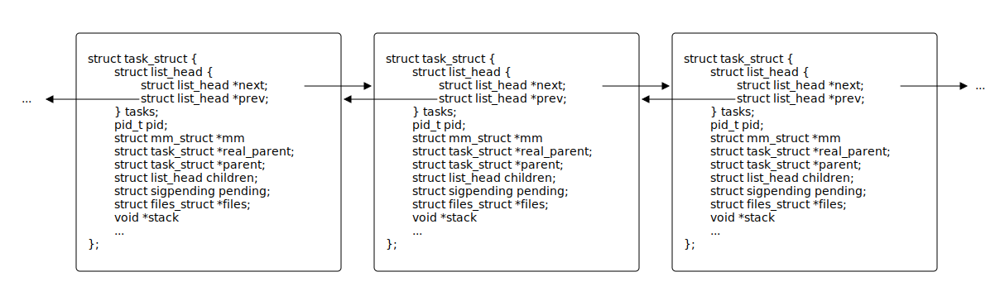

## How can we check which processes are running at the moment

The `ps` program can show us all processes, the `top` program display
processes interactively, the `pstree` prints a tree of processes and
the pseudo file system `/proc` contains entries representing every process.
```bash
$ ps aux
```
```bash
$ top
```
```bash
$ pstree
```
```bash
$ ls /proc
```

## Running processes in Bash - how does it work

A primitive system shell could be implemented like this:
```c
while (true) {
    char *line = readline("$ ");
    char *my_argv[12] = {0};
    if (!parse_line(line, my_argv, ARRAY_SIZE(my_argv) - 1))
        goto out;

    int pid = fork();
    if (pid == 0)
        execvp(my_argv[0], my_argv);

    int status;
    waitpid(pid, &status, 0);
    report(status);
out:
    free(line);
}
```

## Running processes in background

In `ls &` command, the `&` will run the process in the background.
It omits the call to `waitpid()`.

```c
while (true) {
    char *line = readline("$ ");
    char *my_argv[12] = {0};
    if (!parse_line(line, my_argv, ARRAY_SIZE(my_argv) - 1))
        goto out;
    int pid = fork();
    if (pid == 0)
        execvp(my_argv[0], my_argv);
    int status;
    if (in_background(line))
        status = 0;
    else
        waitpid(pid, &status, 0);
    report(status);
out:
    free(line);
}
```

## Question: If we omit `waitpid()` and bash is still running, why there are no zombie processes?

After all, this is how zombie processes are created.

What are we missing?

## Answer: If we omit `waitpid()` and bash is still running, why there are no zombie processes?

When a child process finishes, the parent is notified with `SIGCHLD`. Bash
calls `wait` system call in `SIGCHLD` handler, which allows to read process exit
code and remove it from list of processes.

```c
/* sigchld_handler () flushes at least one of the children that we are
   waiting for.  It gets run when we have gotten a SIGCHLD signal. */
static sighandler sigchld_handler(int sig) {
    int n, oerrno;
    oerrno = errno;
    REINSTALL_SIGCHLD_HANDLER;
    sigchld++;
    n = 0;
    if (queue_sigchld == 0)
        n = waitchld (-1, 0);
    errno = oerrno;
    SIGRETURN (n);
}
```

## Question: Will zombie process be created?

The `exec` command calls one of `exec*()` system calls, which causes current
process to execute different program, by replacing the code section of the current
process and reinitializing process memory.

The `/usr/bin/sleep` simply wait the specified number of seconds

The questions are:

- **Will zombie process be created in the below case?**
- **If so, then why will it be created?**
- **If so, how long will it exist in a zombie state?**

```bash
$ /usr/bin/sleep 5 &        
$ exec /usr/bin/sleep 3600
```

## Answer: Will zombie process be created?

```bash
$ /usr/bin/sleep 5 &         # spawn child
$ exec /usr/bin/sleep 3600   # replace bash with sleep - erases signal handler
```

Answers:

- **Will zombie process be created in the below case?**
    - Yes.
- **Why it will be created**
    - Because `sleep` does not implement `SIGCHLD` signal handler.
- **How long will it exist in a zombie state**
    - The child executes for `5` seconds, the parent `3600` seconds. The child
      will be in zombie state `3595` seconds.

## Detaching processes from the shell

Runs `COMMAND`, redirects `stdout` and `stderr` to files in order to avoid termination from
closed terminal and removes the `PID` from bash job list, which will prevent
bash from propagating `SIGHUP`.
```
$ COMMAND >file 2>file &
$ disown PID
```

Runs `COMMAND`, but prevents it from receiving `SIGHUP`, also redirects
the `stdin` and `stdout`.
```
$ nohup COMMAND &
```

Runs process with the help of `screen` program, which thanks to `-d` option
will disconnect itself from the `bash` process.
```
$ screen -d -m COMMAND
```

## Example programs - `watch`

Executes a program periodically, showing output fullscreen.


Show processes periodically:

```bash
$ watch ps aux
```

Show memory usage in real time:
```bas
$ watch -n0 df
```

## Task: Detaching from the terminal

1. Run `tar` program so that it would compress
   the selected directory located in home directory
   into `~/archive.tar.gz` every minute. The process
   should not be terminated after closing the terminal.
2. If the process survived after closing the terminal, kill
   it with `kill` program.

You can get the `PID` of the process using `ps` program or `pidof`.

# Input and output

## Standard input, output and error

Bash is started with 3 file descriptors open pointing to the terminal, numbered `0`, `1` and `2`.
They are called standard input, standard output and standard error stream.

The `cat` program will block, waiting for input from `0`.
```bash
$ cat

```
The `echo` program will write to `1`.
```bash
$ echo hello
```
The `ls` program will write errors to `2`
```bash
$ ls --cookies
ls: unrecognized option '--cookies'
```

## Redirecting input

You can start process with a file descriptor pointing to a file instead of
a terminal

Start `cat` with `foo` file as standard input
```bash
$ cat < foo
bar
```
Start `echo` with `foo` file as standard output
```bash
$ echo bar > foo    # will create ovewrite the 'foo' file
$ echo bar >> foo   # will append to the `foo` file
```

Start `ls` with `foo` file as standard error stream.
```bash
$ ls --cookies 2> foo
```

## Opening other file descriptos

The `0`, `1` and `2` are just arbitrary numbers. You can open
other file descriptors if you want.

Run `echo` process with file descriptor `5` pointing to `foo` file.
```bash
$ echo bar 5>foo
```
Run `read` command with file descriptor `13` pointing to `foo` file
and read a line from descriptor `13` into variable `bar`
```bash
$ read -u 13 bar 13< foo
```

## HEREDOC

You can run a child process with the standard input pointing to temporary
file created by `bash` with desired contents:

```bash
$ cat <<EOF
abcdef
abcdef
EOF
abcdef
abcdef
```

```bash
$ ls -l /proc/self/fd <<< "foo"
lr-x------ 64 jane 21 mar  0:18 0 -> /tmp/sh-thd.PCaGIA (deleted)
lrwx------ 64 jane 21 mar  0:18 1 -> /dev/pts/9
lrwx------ 64 jane 21 mar  0:18 2 -> /dev/pts/9
```

## What stdin, stdout and stderr really are?

You can check the opened file descriptors of a `bash` process in the
following way:
```
$ ls -l /proc/$(pidof -s bash)/fd
lrwx------ 64 john 20 mar 22:13 0 -> /dev/pts/9
lrwx------ 64 john 20 mar 22:13 1 -> /dev/pts/9
lrwx------ 64 john 20 mar 22:13 2 -> /dev/pts/9
lrwx------ 64 john 20 mar 23:20 255 -> /dev/pts/9
```

As you can see three open file descriptors,
stdin (`0`), stdout (`1`) and stderr (`2`), point to `/dev/pts/9`, which is
a **pseudoterminal slave**.

These are examples of an character device. A character device acts like a
regular file, but instead of accessing the hard drive, a different specific
functionality will be invoked in the kernel, when you write and read from it.

## The pseudoterminal master and slave

The terminal emulator opens the `/dev/ptmx`, creates a pseudoterminal
slave `/dev/pts/X`, forks a child bash process with `0`, `1` and `2` file
descriptors set to `/dev/pts/X`.

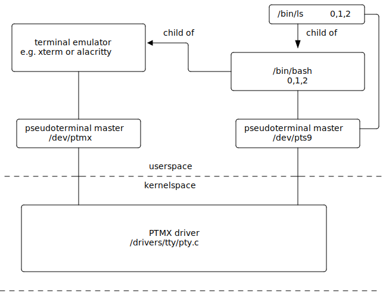

## Question: Can you open a file in a `bash` process?

In other words how can we open a file directly in `bash` process?

Is there an equivalent of:
```c
int fd = open("foo.txt", O_RDONLY, 0);
```
?

## Answer: Can you open a file in a `bash` process?

You can use `exec` command.
```bash
$ exec 44< foo      # calls open("foo", O_RDONLY, 0)
$ read line <&44    # calls read(44, ...)
$ read line <&44    # calls read(44, ...)
$ exec 44<& -       # calls close(44)
```
Writing is also possible:
```bash
$ exec 44> foo      # calls open("foo", O_WRONLY, 0)
$ echo line >&44    # calls write(44, ...)
$ echo line >&44    # calls write(44, ...)
$ exec 44>& -       # calls close(44)
```

## Question: What happens if you close file descriptor 2 for bash process

Try this command:

```bash
$ exec 2>&-
```

Then type:
```
ls<enter>
```

## Answer: What happens if you close file descriptor 2 for bash process

Bash prints its prompt to descriptor `2` (standard error stream).
So if we close it, we will see no prompt. But we standard input is
still open, and also standard output, so typing `ls<enter>` is returns
the directory listing.

# Pipes

## The Unix philosophy

1. Write programs that **do one thing and do it well**
2. Write **programs** to **work together**
3. Write programs to handle **text** streams, because that **is an
   universal interface**

To realize this philosophy we need pipes.

## The concept of pipe

The `|` operator creates a `pipe` between 2 processes.

```bash
$ cat foo.txt | grep bar
```

The `pipe` endpoints are connected to descriptor `1` of the first process and 
`0` of the second process.

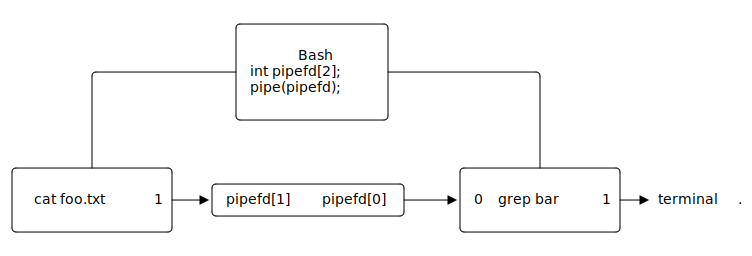

## Examples

Count lines in a file
```
$ cat file | wc -l
```

Replace 'small' with 'BIG'
```bash
$ echo small | sed "s/small/BIG"
```

Remove all `.txt` files in current working directory and child directories
```bash
$ find . -name "*.txt" | xargs -rm -f
```

## Example programs - often used in pipes

Below are programs that are most useful with pipes:

```bash
$ wc -l             # count number of lines in standard input
$ xargs -n1 CMD     # execute CMD for each token from standard input
$ cat               # pass everything from standard input to standard output
$ grep pattern      # print to standard output only lines that contain 'pattern'
$ sed 's/a/B/'      # replace 'a' with 'B'
$ head -n 20        # print first 20 lines
$ tail              # print last 20 lines
$ less              # view contents of standard input interactively
$ more              # view contents of standard input interactively (you can't go back)
$ most              # view contents of standard input interactively (you can go sideways)
$ tr x              # replace 'x' with 'X'
$ bc                # An arbitrary precision calculator
$ yes               # Prints 'y' to standard output
$ cut               # remove section from each line of files
$ tee               # read from standard input and write to standard output and files
$ xclip             # copy standard input to clipboard
```

## Task: Covid prompt

Modify your `~/.bashrc` so that you can see a live counter of total COVID
cases world wide in your prompt.
Create a tiny script that will run `curl` (in background), which will save
current cases from the API in the `~/.cases` file. Then use `cat` to display
it in the prompt.

```
curl --location -s --request GET 'https://api.covid19api.com/summary'
```

You can modify your prompt in `.bashrc`

```bash
foo () {
    PS1="$(cat ~/.cases) \$"
}
PROMPT_COMMAND=foo
```

You will most likely need `jq` to parse `.json` or maybe `grep`.

# Subshells

## What is a subshell?

A subshell is a child Bash process, which is spawned to execute a given command.
Below you can see example operators that will cause Bash to create a subshell

```
(  )
```
```
<(  )
```
```
$(  )
```
```
>(  )
```
```
|
```

## Question: What is the difference when we run `ls` in a subshell

We can check the difference between these 2 commands
```bash
$ ls
```
```bash
$ (ls)
```
By running `strace`

```bash
$ strace -fe execve,clone bash
$ ls
$ (ls)
```

## Answer: What is the difference when we run `ls` in a subshell

There is no difference:
```
$ ls
clone(child_stack=NULL, flags=CLONE_CHILD_CLEARTID|CLONE_CHILD_SETTID|SIGCHLD, child_tidptr=0x7f5eea1e1850) = 865843
[pid 865843] execve("/usr/bin/ls", ["ls"], 0x558097fc94b8 /* 76 vars */) = 0
...
$ (ls)
clone(child_stack=NULL, flags=CLONE_CHILD_CLEARTID|CLONE_CHILD_SETTID|SIGCHLD, child_tidptr=0x7f5eea1e1850) = 865860
[pid 865860] execve("/usr/bin/ls", ["ls"], 0x558097fc94d8 /* 76 vars */) = 0
...
```


## Answer: What is the difference when we run `ls` in a subshell

But actually, there is (complex commands):
```
$ ls; ls
clone(child_stack=NULL, flags=CLONE_CHILD_CLEARTID|CLONE_CHILD_SETTID|SIGCHLD, child_tidptr=0x7f5eea1e1850) = 867887
[pid 867887] execve("/usr/bin/ls", ["ls"], 0x558097fc9528 /* 76 vars */) = 0
clone(child_stack=NULL, flags=CLONE_CHILD_CLEARTID|CLONE_CHILD_SETTID|SIGCHLD, child_tidptr=0x7f5eea1e1850) = 867888
[pid 867888] execve("/usr/bin/ls", ["ls"], 0x558097fc9528 /* 76 vars */) = 0
...
(ls; ls)
clone(child_stack=NULL, flags=CLONE_CHILD_CLEARTID|CLONE_CHILD_SETTID|SIGCHL , child_tidptr=0x7f5eea1e1850) = 867945
[pid 867945] clone(child_stack=NULL, flags=CLONE_CHILD_CLEARTID|CLONE_CHILD_SETTID|SIGCHLD, child_tidptr=0x7f5eea1e1850) = 867946
[pid 867946] execve("/usr/bin/ls", ["ls"], 0x558097fc9528 /* 76 vars */) = 0
[pid 867945] execve("/usr/bin/ls", ["ls"], 0x558097fc9528 /* 76 vars */) = 0
...
```

## Subshells and `cd`

The `cd` is not executed normally as a separate process, but with a subshell
it is.

```
$ cd
$ (cd)
clone(child_stack=NULL, flags=CLONE_CHILD_CLEARTID|CLONE_CHILD_SETTID|SIGCHLD, child_tidptr=0x7f5eea1e1850) = 871287
strace: Process 871287 attached
[pid 871287] +++ exited with 0 +++
--- SIGCHLD {si_signo=SIGCHLD, si_code=CLD_EXITED, si_pid=871287, si_uid=1000, si_status=0, si_utime=0, si_stime=0} ---
--- SIGWINCH {si_signo=SIGWINCH, si_code=SI_KERNEL} ---
```

## Subshells - explanation

When we call the following command

```bash
$ (ls; ls)
```

The following happens:

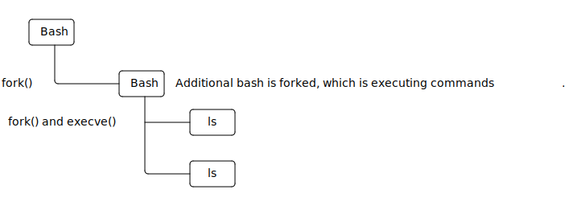

## Subshells - optimization

Bash will omit the second `fork()` is it is not neccessary.

```
$ (ls)
```

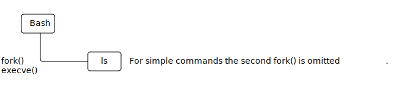

## Wielozadaniowość na wielu procesorach/rdzeniach

W przypadku wielu procesorów, system operacyjny może uruchamiać procesy
rzeczywiście równolegle

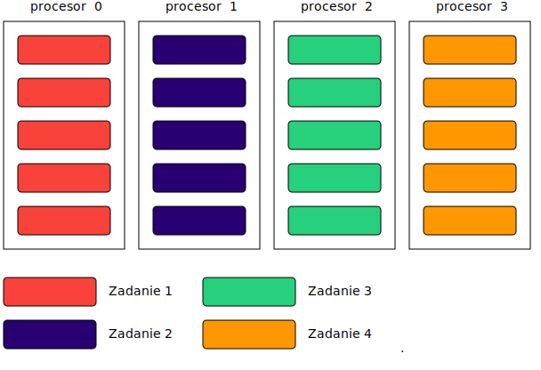

## Wielozadaniowość na wielu procesorach/rdzeniach

W praktyce procesy mogą być uruchamiane na różnych rdzeniach procesora.

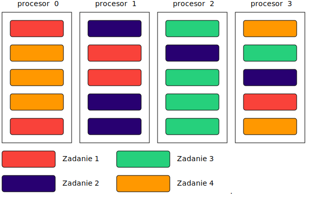

## Afiniczność procesora

W Linuksie możemy określić na których procesorach będzie wykonywany proces

```bash
$ taskset -p 0x11 9726
```

Podobne ustawienie istnieje również w menedżerze zadań systemu Windows

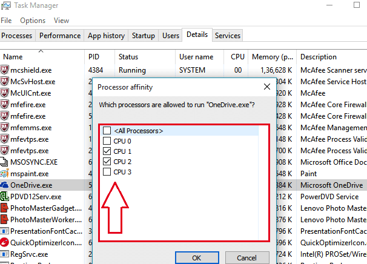

# Procesy

## Procesy w systemie Linux

Procesem nazywamy program, który się wykonuje.
W skład procesu wchodzą:

- **Stan procesora (rejestry).** Dla `x86_64` są to:
    - `rbp` - wskaźnik początku stosu
    - `rsp` - wskaźnik końca stosu (ang. Stack pointer)
    - `rip` - wskaźnik aktualnej instrukcji (ang. Program counter)
    - `rflags` - rejest flag procesora
    - rejestry ogólnego przeznaczenia: `rax`, `rcx`, `rdx`, `rbx`, `rsi`, `rdi`, `r8`-`r15`
- **Pamięć wirtualna** (Tabela stron) (wskazywana przez rejestr `CR3`)
- **Deskryptory plików**, czyli (najważniejsze):
    - pliki (otwarte za pomocą `open()`)
    - gniazda sieciowe (otwarte za pomocą `socket()`, `accept()`)
    - potoki (otwarte za pomocą `pipe()`)
    - demultiplexery zdarzeń (otwarte za pomocą `epoll_create()`)
- Inne struktury danych istotne dla jądra Linux

## Podglądanie procesów w systemie

W systemie Linux, uruchomione procesy możemy zobaczyć za pomocą
programu `ps`

```console
$ ps
  PID TTY           TIME CMD
  896 ttys000    0:00.10 -bash
 1073 ttys001    0:00.08 -bash
 7601 ttys001    0:00.02 bash /Users/hehe/v/e @
 7603 ttys001    1:40.37 nvim
 1074 ttys002    0:00.15 -bash
75444 ttys002    0:00.00 (sleep)
 6110 ttys003    0:00.50 -bash
75450 ttys003    0:00.00 bash /Users/hehe/v/y
 7870 ttys004    0:00.09 -bash
75448 ttys004    0:00.00 sleep 1
```

Liczba `PID` to unikalny identyfikator procesu.

## Podglądanie procesów w systemie - top

Programy `top` oraz `htop` umożliwają podgląd procesów w czasie rzeczywistym

```console
$ top
top - 22:20:33 up 56 min,  1 user,  load average: 0,33, 0,52, 0,56
Zadania:razem: 328, działających:   2, śpiących: 326, zatrzymanych:   0, zombie:   0
%CPU:  2,9 uż,  1,8 sy,  0,0 ni, 95,3 be,  0,0 io,  0,0 hi,  0,0 si,  0,0 sk
MiB RAM :  15888,6 razem,   9129,5 wolne,   3037,6 użyte,   3721,6 buf/cache
MiB Swap:   4880,0 razem,   4880,0 wolne,      0,0 użyte.  12497,1 dost. RAM

    PID UŻYTK.    PR  NI    WIRT    REZ    WSP S  %CPU  %PAM     CZAS+ KOMENDA
   1452 hehe       9 -11 2731536  20752  16068 S   8,0   0,1   0:55.86 pulseaudio
   3269 hehe      20   0  522940  55472  40716 R   5,7   0,3   4:34.44 x-terminal-emul
   9773 hehe      20   0  217860  52624  35892 S   4,6   0,3   1:22.04 MainThread
   5321 hehe      20   0 4935640 751040 310720 S   3,4   4,6   4:44.81 firefox
   8058 hehe      20   0  319064  50504  39920 S   2,3   0,3   0:54.45 RDD Process
  34580 hehe      20   0   23400   4224   3288 R   2,3   0,0   0:00.05 top
    287 root      20   0       0      0      0 I   1,1   0,0   0:02.22 kworker/4:1-events
   1903 hehe      20   0 4463536 392068 118248 S   1,1   2,4   1:30.14 gnome-shell
   1989 hehe      20   0  396140   8576   7056 S   1,1   0,1   0:20.24 ibus-daemon
   2286 hehe      20   0 5165376 252416  77816 S   1,1   1,6   0:09.15 dropbox
      1 root      20   0  170040  14056   8280 S   0,0   0,1   0:01.51 systemd
```

## Podglądanie procesów w systemie - pseudo system plików /proc

```console
$ ls /proc
1   42   129  289  978   1259  1580  2103  8238   34694          kpageflags
2   43   132  290  981   1285  1627  2104  8403   34695          loadavg
3   44   133  291  986   1286  1630  2105  8648   35412          locks
4   46   136  349  990   1301  1762  2106  8808   35848          mdstat
6   47   138  350  994   1358  1780  2107  8827   35849          meminfo
8   48   139  351  1009  1374  1850  2109  8968   35855          misc
9   49   142  353  1011  1377  1870  2110  8970   acpi           modules
10  50   150  437  1013  1378  1875  2118  9421   asound         mounts
11  52   153  438  1015  1379  1881  2192  9773   bootconfig     mtrr
12  53   154  491  1017  1380  1888  2194  10510  buddyinfo      net
13  54   159  519  1019  1381  1903  2247  12703  bus            pagetypeinfo
14  55   194  520  1021  1407  1989  2260  13057  cgroups        partitions
15  56   219  522  1023  1411  1993  2286  13159  cmdline        pressure
16  58   221  524  1025  1412  1994  2376  15059  consoles       schedstat
17  59   242  526  1078  1414  1998  2391  19363  cpuinfo        scsi
18  60   244  528  1079  1421  2004  2513  19374  crypto         self
19  61   245  529  1116  1450  2008  2681  27384  devices        slabinfo
20  62   247  620  1117  1452  2016  3269  27437  diskstats      softirqs
```

## Drzewo procesów

Drzewo procesów możemy ujrzeć za pomocą programu `pstree`

```console
$ pstree
systemd─┬─ModemManager───2*[{ModemManager}]
        ├─NetworkManager───2*[{NetworkManager}]
        ├─fwupd───4*[{fwupd}]
        ├─gdm3─┬─gdm-session-wor─┬─gdm-x-session─┬─Xorg───{Xorg}
        │      │                 │               ├─gnome-session-b─┬─ssh-agent
        │      │                 │               │                 └─2*[{gnome-session-b}]
        │      │                 │               └─2*[{gdm-x-session}]
        │      │                 └─2*[{gdm-session-wor}]
        │      └─2*[{gdm3}]
        ├─polkitd───2*[{polkitd}]
        ├─systemd─┬─(sd-pam)
        │         ├─tmux: server─┬─bash───bash───nvim─┬─2*[xclip]
        │         │              │                    └─{nvim}
        │         │              ├─bash───bash───sleep
        │         │              ├─bash
        │         │              └─bash─┬─bash
        │         │                     └─pstree
       ...       ...
```

# Tworzenie procesów

## Wywołanie systemowe - `fork()`

Do tworzenia procesów, służy wywołanie systemowe `fork()`.
Wywołanie `fork()` tworzy proces potomny, który jest "klonem"
procesu rodzica.

```c
   int main(void)
   {
       printf("przed utworzeniem\n");
-->    int pid = fork();
       ...
   }
```
Po wywołaniu `fork()`:
```c
   /* rodzic */                         /* dziecko */
   int main(void)                       int main(void)
   {                                    {
       printf("przed utworzeniem\n");       printf("przed utworzeniem\n");
-->    int pid = fork();             -->    int pid = fork();
       ...                                  ...
   }                                    }
```

## Wartość zwracana `fork()`

Wywołanie `fork()` w procesie potomnym zwraca `0`, natomiast w procesie
rodzica wartością zwróconą będzie PID procesu potomnego.

```c
   /* rodzic */                         /* dziecko */
    int main(void)                       int main(void)
    {                                    {
        printf("przed utworzeniem\n");       printf("przed utworzeniem\n")j
        int pid = fork();                    int pid = fork();
        if (pid == 0)                        if (pid == 0)
            printf("child\n");        -->        printf("child\n");   
        else                                 else
 -->        printf("parent\n");                  printf("parent\n");  
        return 0;                            return 0;
    }                                    }
```

Na podstawie wartości zwracanej, możemy określić czy "znajdujemy" się
w procesie potomnym czy w procesie rodzica.

## Oczekiwanie na zakończenie procesu potomnego

Do oczekiwania na zakończenie procesu potomnego służy, wywołanie
systemowe `wait()`, które blokuje program do momentu zakończenia
dowolnego procesu potomnego.

```c
   /* rodzic */                         /* dziecko */
    int main(void)                       int main(void)
    {                                    {
        printf("przed utworzeniem\n");       printf("przed utworzeniem\n")j
        int pid = fork();                    int pid = fork();
        if (pid == 0) {                      if (pid == 0) {
            printf("child\n");                   printf("child\n");   
        } else {                             } else {
            printf("parent\n");                  printf("parent\n");  
 -->        wait(NULL);                          wait(NULL);
        }                                    }
        return 0;                     -->    return 0;
    }                                    }
```

## `wait()` obsługa błędów

Wywołanie systemowe `wait()` zwraca `pid` zakończonego procesu.
Jeżeli wartość jest ujemna to wystąpił błąd. Błąd uzyskać można
odczytująć zmienną `errno`.

```c
pid = wait(NULL);
if (pid < 0) {
    fprintf(stderr, "error: wait: %s\n", strerror(errno));
    return -1;
}
```

## `wait()` odczytanie wartości zwracanej

Można odczytać wartość jaką zwrócił proces potomny przekazując
wskaźnik jako pierwszy argument wywołania `wait()`.

```c
int status;
pid = wait(&status);
if (pid < 0) {
    fprintf(stderr, "error: wait: %s\n", strerror(errno));
    return -1;
}
if (WIFEXITED(status))
    printf("dziecko zwróciło: %d\n", WEXITSTATUS(status));
```


## Oczekiwanie na zakończenie kilku procesów potomnych

Wywołanie systemowe `wait()` czeka na pierwszy proces potomny,
który ulegnie zakończeniu. Jeżeli utworzonych zostało więcej procesów
potomnych, to należy ponowić oczekiwanie.

```c
while (true) {
    int pid = wait(NULL);
    if (pid < 0) {
        /* Nie ma już dzieci */
        if (errno == ECHILD)
            break;
        /* Wystąpił rzeczywisty błąd */
        fprintf(stderr, "error: wait: %s\n", strerror(errno));
        break;
    }
}
```

## Wywołanie `waitpid()`

Wywołanie systemowe `waitpid()` pozwala zaczekać na konkretny process potomny

```c
int status;
waitpid(pid, &status, 0);
if (WIFEXITED(status))
    printf("dziecko zwróciło: %d\n", WEXITSTATUS(status));
```

Tak naprawde `wait()` działa tak samo jak:

```c
int pid = waitpid(-1, &status, 0);
```

Więcej informacji
```console
$ man 2 wait
```

## Najistotniejsze efekty `fork()`

Podczas **wywołania systemowego** `fork()`:

- Używany jest ten dalej ten sam **kod programu**
- Kopiowany jest **stan procesora** (w tym **wskaźnik aktualnej instrukcji**)
- Dziedziczone są **deskryptory plików**:
- Kopiowana są **strony pamięci**, ale dopiero po pierwszym zapisie (**Copy-on-write**)

## Tworzenie procesu, który będzie wykonywał inny program

Wywołanie `fork()` powoduje utworzenie nowego procesu, który jest niemalże
dokładną kopią procesu potomnego. Żeby zmienić kod wykonywanego programu należy
użyc funkcji z rodziny `exec()`
```c
int execl(const char *path,
          const char *arg0, ..., /*, (char *)0, */);
int execle(const char *path,
           const char *arg0, ..., /* (char *)0 char *const envp[] */);
int execlp(const char *file,
           const char *arg0, ..., /*, (char *)0, */);
int execv(const char *path, char *const argv[]);
int execvp(const char *file, char *const argv[]);
int execvP(const char *file, const char *search_path,
          kchar *const argv[]);
```

Wywołanie systemowe `exec()` ładuje nowy program do aktualnego
procesu (czyli podmienia sekcje .data, .bss, .text, stos i sterte, biblioteki współdzielone)

## Przykład wykorzystania `exec()`

Przykładowy program, który utworzy proces potomny i załaduje do niego
program `ls`. Proces rodzica będzie czekał na zakończenie procesu potomnego.

```c
int main(int argc, char **argv)
{
    int ret;
    ret = fork();
    if (ret == 0) {
        char *argv[] = { "ls", NULL };
        ret = execvp("ls", argv);
        if (ret) {
            perror("execvp: ");
            return 1;
        }
    }

    wait(NULL);

    return 0;
}
```

## Procesy zombie

Jeżeli proces zakończył swoje wykonywanie, a rodzic nie wykonał `wait()`
to będzie on nadal widoczny na liście procesów, do momentu wykonania `wait()`
przez rodzica.

Poniższy kod tworzy proces zombie, który będzie istniał około 30 sekund:
```c
#include <unistd.h>

int main(void)
{
    /* Klonujemy proces */
    int pid = fork();
    /* Jeżeli jesteśmy dzieckiem */
    if (pid == 0)
        return 0; /* Kończymy - proces jest zombie do wykonania wait() */
    /* Jeżeli jesteśmy rodzicem to czekamy 30 sekund*/
    sleep(30);
    /* Odczytujemy kod wyjścia procesu i usuwamy go z listy procesów */
    wait(NULL);
    return 0;
}
```

## Pytanie

Jeżeli nie wywołamy `wait()`, to dlaczego dziecko znika po zakończeniu rodzica?

```c
#include <unistd.h>

int main(void)
{
    int pid = fork();
    if (pid == 0)
        return 0;

    /* Nie wywołujemy tutaj wywołania systemowego wait(), więc nie zakończymy
       dziecka */

    return 0;
}
```

## Odpowiedź

Każdy osierocony proces jest adoptowany przez główny proces (`systemd` albo `init`).

```console
$ pstree
systemd─┬─ModemManager─── ...
        ├─NetworkManager─── ...
        ├─fwupd───4*[{fwupd}]
        ├─gdm3─┬─gdm-session-wor─┬─gdm-x-session─┬─Xorg───{Xorg}
        │      │                 │               ├─gnome-session-b─┬─ssh-agent
        │      │                 │               │                 └─2*[{gnome-session-b}]
        │      │                 │               └─2*[{gdm-x-session}]
        │      │                 └─2*[{gdm-session-wor}]
        │      └─2*[{gdm3}]
        ├─ X
       ... ^
           |
           '---- tu zostanie zaadoptowany osierocony proces
```
Następnie `systemd` lub `init` wywoła na nim `wait()`.

## Zagadka 0

Ile procesów zostanie utworzonych w poniższym programie?

```c
#include <unistd.h>

int main(void)
{
    fork();
    fork();
    fork();

    fork();
    fork();
    fork();

    return 0;
}
```
## Zagadka 1

Ile procesów zostanie utworzonych w poniższym programie?

```c
#include <unistd.h>

int main(void)
{
    for (int i = 0; i < 10; ++i)
        fork();

    return 0;
}
```
## Zagadka 2

Ile procesów zostanie utworzonych w poniższym programie?

```c
#include <unistd.h>

int main(void)
{
    for (int i = 0; i < 10; ++i) {
        fork();
        execlp("ls", "ls", NULL);
    }

    return 0;
}
```

# Planista

## Planista w systemie Linux

Decydowaniem, który proces zostanie uruchomiony jako następny zajmuje
się planista (ang. scheduler).

Zadaniem planisty jest dbanie o podział czasu procesora według ustalonych celów.

Planista w systemie Linux to **Całkowicie Sprawiedliwy Planista** (ang. Completely Fair Scheduler, CFS)

Dba on o to aby każdy proces otrzymał sprawiedliwą część czasu procesora.

Za każdym razem uruchamia ten process który otrzymał do tej pory najmniej
czasu, w stosunku do należnej części.

## Jak planista reprezentuje procesy

W systemie Linux każdy proces, jest reprezentowany przez strukturę `struct task_struct`

Oto jej ważniejsze pola:

```c
struct task_struct {
    struct list_head tasks           /* Wpis na liscie procesów */
    pid_t pid;                       /* Identyfikator procesu */
    struct mm_struct *mm             /* Przestrzeń adresowa */
    struct task_struct *real_parent; /* Prawdziwy rodzic - ten kto wywołał clone() */
    struct task_struct *parent;      /* Odbiorca SIGCHLD i wait4() */
    struct list_head children;       /* Dzieci procesu */
    struct sigpending pending;       /* Lista oczekujących sygnałów */
    struct files_struct	*files;      /* Otwarte deskryptory plików */
    void *stack                      /* Wskaznik do stosu jądra dla tego
                                        procesu - tu są zapisane rejestry */
    ...
};
```

## Lista procesów

System operacyjny przechowuje procesy na liście dwukierunkowej.


## Jak CFS przydziela czas procesora

Długości odcinków czasowych są wyliczane dynamicznie, na podstawie docelowego
opóźnienia (ang. target latency) i priorytetu procesu (niceness i priority),
dzięki czemu podział czasu procesora jest zawsze sprawiedliwy.


## Preemptive vs Cooperative multitasking

W przypadku preemptive multitasking planista może wywłaszczyć proces w dowolnym
momencie, w przypadku cooperative - tylko w wyznaczonym przez proces momencie.
**Planista w Linuksie implementuje preemptive multitasking.**

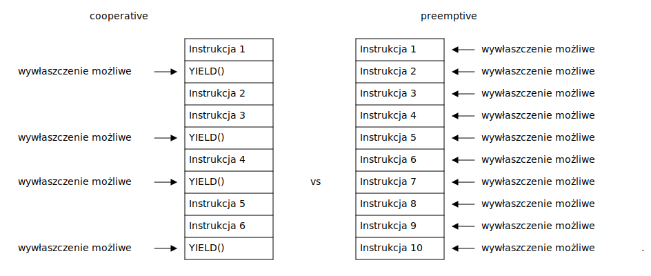

## Kiedy następuje wywłaszczenie

CFS może zaplanować wykonywanie innego procesu w momencie wystąpienia przerwania:

Czyli na przykład w momencie:

- naciśnięcia klawisza, odebrania pakietu sieciowego czy innego zdarzenia sprzętowego;
- przerwania pochodzącego od czasomierza systemowego (Programmable System Timer);
- wywołania systemowego (np. `open()`, `fork()`, `sleep()`, `write()`).

```c
int main(void)
{
    int x, w;
    x = 1;                               <---- tu może wystąpić przerwanie, możliwa zmiana procesu
    printf("%d\n", x);                   <---- wywołanie systemowe write(), możliwa zmiana procesu
    int fd = open("plik.txt", O_RDONLY); <---- wywołanie systemowe open(), możliwa zmiana procesu
    w = x + 1;                           <---- tu może wystąpić przerwanie, możliwa zmiana procesu
    int *g = malloc(sizeof(*g));         <---- malloc() nie jest wywołaniem systemowym ale
                                               może wywołać brk(), sbrk(), mmap(), które są,
                                               czyli możliwa zmiana procesu
}
```

# Wywołania systemowe

## Co jest efektem kompilacji?

Kod w języku C jest kompilowany do instrukcji maszynowych

```c
int foo(int a, int b)  _foo: 
{                      pushq %rbp            // Zapisz podstawe stosu
	int c = a + b;     movq  %rsp, %rbp      // Weź szczyt stosu jako podstawę
	return c;          movl  %edi, %eax      // Wrzuć pierwszy argument do %eax
}                      addl  %esi, %eax      // Dodaj drugi argument do %eax
                       movl  %eax, -4(%rbp)  // Wynik wrzuć na stos
                       movl  -4(%rbp), %eax  // Przekaż wartość zwracaną przez %eax
                       popq  %rbp            // Załaduj zapisaną podstawę stosu podstawę stosu
                       retq                  // Wróć z powrotem w miejsce wywołania  
```

## Instrukcje uprzywilejowane

Nie wszystkie instrukcje procesora są dostępne dla procesów użytkownika.
Procesy użytkownika nie mogą między innymi odczytywać pamięci chronionej, ani wykonywać niektórych instrukcji. Na przykład:

- `LGDT` - nadpisywanie tablicy przerwań;
- `IN`, `OUT` - obługa urządzeń wejścia/wyjścia;
- `MOV %eax, %cr3` - modyfikacja tablicy stron.

Procesy mogą jedynie "prosić" system operacyjny, żeby on w ich imieniu
wykonywał te instrukcje. Tą prośbą są **wywołania systemowe**.

## Wywołania systemowe

Wywołania systemowe, są przerwaniem programowym (ang. software interrupt)

1. Program wykonuje przerwanie (`syscall` lub `int 0x80`), w rejestrach ustawia
   odpowieni numer przerwania oraz przekazuje odpowiednie argumenty
2. System operacyjny zaczyna wykonywać procedurę obsługi tego przerwania:
   zapisuje stan procesora, przełącza stos programu na stos jądra (zmienia rejestr `%esp` - wskaźnik stosu), i wykonuje
   odpowiednią operację wskazaną numerem wywołania systemowego.
3. Po wykonaniu wywołania systemowego system operacyjny przywraca stan procesora (w tym stos procesu)
   i wznawiane jest wykonywanie programu.

```asm
message:
    .asciz "Hello world\n"
.set message_size, . - message
...
movl $1, %edi
leaq message(%rip), %rsi
movq $message_size, %rdx
movq $1, %rax             ;1 is sys_write syscall number
syscall
```

## Wywołania systemowe a funkcje

Biblioteka standardowa języka C (np. `glibc`, `musl` lub `uClibc`), implementuje
funkcje, które uruchamiają wywołania systemowe o podobnych nazwach.
Oprócz tego implementuje jeszcze dodatkową funkcjonalność oraz funkcje, które
nie są wywołaniami systemowymi.

Przykłady:

|  funkcja   | typ                                            |
|------------|------------------------------------------------|
| `open()`   | `syscall(SYS_open, ...)`                       |
| `fork()`   | `syscall(SYS_fork, ...)`                       |
| `write()`  | `syscall(SYS_write, ...)`                      |
| `read()`   | `syscall(SYS_read, ...)`                       |
| `printf()` | `syscall(SYS_write)` + dodatkowa funkcjonalność|
| `malloc()` | `syscall(SYS_brk)` + dodatkowa funkcjonalność  |
| `fopen()`  | `syscall(SYS_open)` + dodatkowa funkcjonalność |
| `strlen()` | funkcja biblioteczna                           |
| `memcpy()` | funkcja biblioteczna                           |

# Pamięć procesu

## Zmienne reprezentują komórki pamięci

Każda zmienna reprezentuje pewną komórkę pamięci.

```c
int y = 2; /* Zmienna w sekcji .data */

int main(void)
{
    int x; /* Zmienna na stosie */

    printf("%p\n", &x);
    printf("%p\n", &y);

    return 0;
}
```

## Pamięć wirtualna

Proces operuje na wirtualnych adresach pamięci, które są mapowane do
fizycznych adresów, przez tabele stron. Instruuje ona jednostkę zarządzania
pamięcią (ang. Memory Management Unit) w jaki sposób ma mapować pamięć.


## Sekcje pamięci 

W systemie Linux skompilowany program będzie miał odpowiednią strukturę w pamięci:

```c
int x;  /* Niezainicjalizowane dane (.bss) */
int y = 3; /* Zainicjalizowane dane (.data) */
void foo(int x) /* Argumenty w rejestrach lub na stosie */     ---.
{                                                                 |
    static int x; /* Niezainicjalizowane dane (.bss) */           |
    static int y = 4; /* Zainicjalizowane dane (.data) */         |
}                                                                 |
int main(void)                                                    |    kod
{                                                                 |___ programu
    int x; /* Alokacja na stosie */                               |    umieszczany
    int *y = malloc(1024); /* Wskaźnik na stosie, */              |    w sekcji .text
                           /* a blok pamięci na stercie */        |
    foo(1); /* Adres powrotu na stosie,                           |
               argumenty w rejestrach lub na stosie  */           |
    return 0;                                                     |
}                                                              ---'

```

## Sekcje pamięci procesu

Pamięć procesu podzielona jest na sekcje, w których znajdują się "podobnego" rodzaju dane.


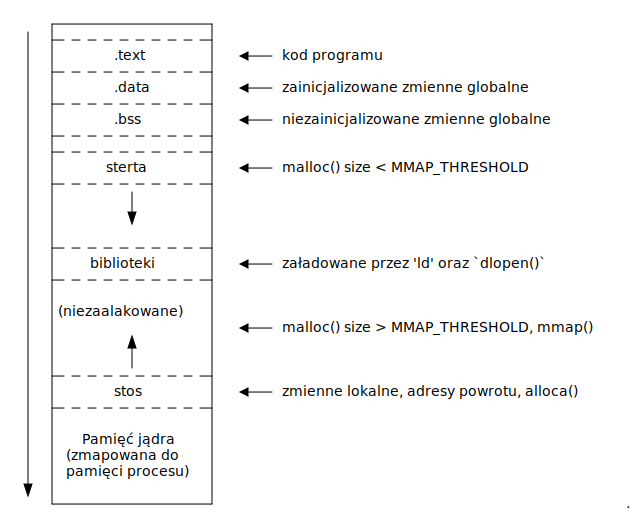

## Przykład sekcji pamięci - proces `yes`

```console
$ cat /proc/39299/maps
56148e969000-56148e96b000 r--p 00000000 08:05 24118661   /usr/bin/yes
56148e96b000-56148e96f000 r-xp 00002000 08:05 24118661   /usr/bin/yes
56148e96f000-56148e971000 r--p 00006000 08:05 24118661   /usr/bin/yes
56148e972000-56148e973000 r--p 00008000 08:05 24118661   /usr/bin/yes
56148e973000-56148e974000 rw-p 00009000 08:05 24118661   /usr/bin/yes
56148f694000-56148f6b5000 rw-p 00000000 00:00 0          [heap]
7f9f89876000-7f9f8a8cc000 r--p 00000000 08:05 24117276   /usr/lib/locale/locale-archive
7f9f8a8cc000-7f9f8a8ee000 r--p 00000000 08:05 24122481   /usr/lib/x86_64-linux-gnu/libc-2.31.so
7f9f8a8ee000-7f9f8aa66000 r-xp 00022000 08:05 24122481   /usr/lib/x86_64-linux-gnu/libc-2.31.so
7f9f8aa66000-7f9f8aab4000 r--p 0019a000 08:05 24122481   /usr/lib/x86_64-linux-gnu/libc-2.31.so
7f9f8aab4000-7f9f8aab8000 r--p 001e7000 08:05 24122481   /usr/lib/x86_64-linux-gnu/libc-2.31.so
7f9f8aab8000-7f9f8aaba000 rw-p 001eb000 08:05 24122481   /usr/lib/x86_64-linux-gnu/libc-2.31.so
7f9f8aaba000-7f9f8aac0000 rw-p 00000000 00:00 0
7f9f8aae0000-7f9f8aae1000 r--p 00000000 08:05 24122477   /usr/lib/x86_64-linux-gnu/ld-2.31.so
7f9f8aae1000-7f9f8ab04000 r-xp 00001000 08:05 24122477   /usr/lib/x86_64-linux-gnu/ld-2.31.so
7f9f8ab04000-7f9f8ab0c000 r--p 00024000 08:05 24122477   /usr/lib/x86_64-linux-gnu/ld-2.31.so
7f9f8ab0d000-7f9f8ab0e000 r--p 0002c000 08:05 24122477   /usr/lib/x86_64-linux-gnu/ld-2.31.so
7f9f8ab0e000-7f9f8ab0f000 rw-p 0002d000 08:05 24122477   /usr/lib/x86_64-linux-gnu/ld-2.31.so
7f9f8ab0f000-7f9f8ab10000 rw-p 00000000 00:00 0
7ffe6a478000-7ffe6a499000 rw-p 00000000 00:00 0          [stack]
7ffe6a5cb000-7ffe6a5cf000 r--p 00000000 00:00 0          [vvar]
7ffe6a5cf000-7ffe6a5d1000 r-xp 00000000 00:00 0          [vdso]
ffffffffff600000-ffffffffff601000 --xp 00000000 00:00 0  [vsyscall]
```

## Address space layout randomization

Adresy sekcji są losowe, aby utrudnić manipulacje na pamięci atakującemu.

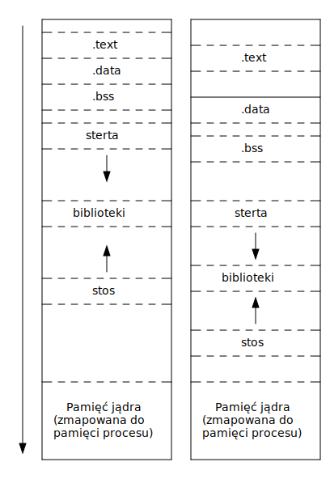

## KASLR

Jądro jest mapowane pod losowym adresem

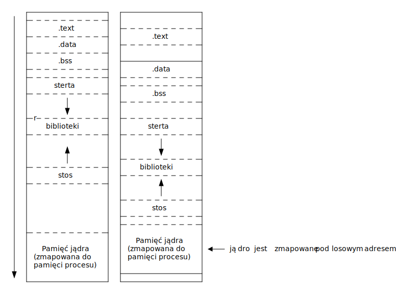

## KAISER

Mapowana jest tylko niezbędna część jądra. Po przełączeniu się w tryb jądra (przy wywołaniach systemowych)
tabela stron jest przełączana na pełną wersję (zmiana rejestru CR3).

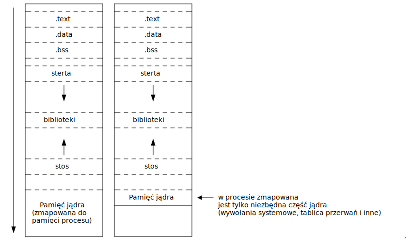

## Copy-on-write

Strony pamięci wirtualnej nowego procesu oznaczone są jako tylko do odczytu.
Próba nadpisania skutkuje wyjątkiem Page Fault, którego obsługa pozwala systemowi
operacyjnemu skopiować stronę


# Dziękuję za uwagę

## Dalsza lektura

- **Książki**
    - Love Robert. 2010. Linux Kernel Development. Pearson Education.
    - Love Robert. 2013. Linux System Programming. O'REILLY.
    - Stevens Richard W., Rago Stephen A., Advanced Programming in the UNIX® Environment, Third Edition. Addison-Wesley.
- **Artykuły**
    - https://lwn.net/Articles/738975/
    - https://samwho.dev/blog/context-switching-on-x86/
- **Manual**
    - `man 2 fork`
    - `man 2 wait`
    - `man 3 exec`
