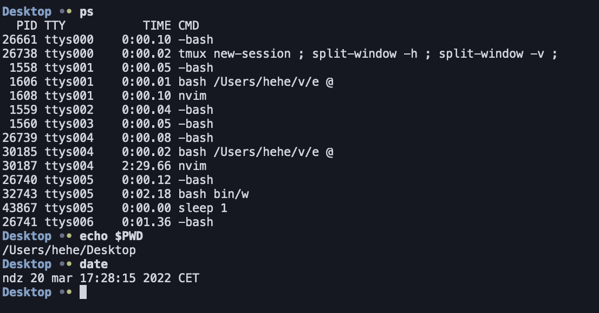
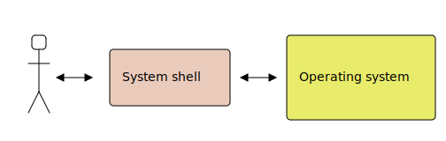
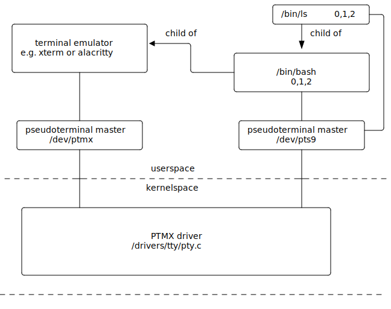
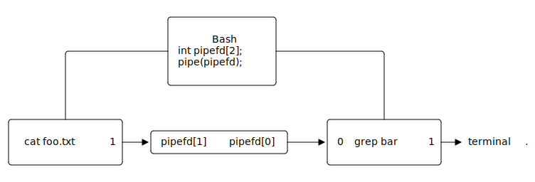
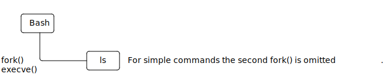

# Bash training

## Bash

Bash is an Unix shell and command language written for the GNU Project



## System shell

**System shell** is a computer program, which acts as an interface
between operating system, applications and the user. Using the shell,
user can interact with the operating system e.g. **run processes**,
perform operations on files, change system settings etc.



## Examples of system shells - Windows File Explorer

File Explorer is an application, which allows user to open files and run processes.
It is an example of a graphical system shell.


## Examples of system shells - Xbox Series X dashboard

The purpose of Xbox dashboard is to run processes (games), therefore it
can also be considered as an example of a graphical system shell.


## Examples of system shells - Bash

Bash is an example of a command-line shell. Other example of command line shells
include i. a. `zsh`, `tcsh`, `busybox ash` and `fish` shell.


## Question: Why do we still use a command-line interface?

Why in the era of graphical user interfaces and amazing user experiences
programmers still work using the "ancient" command line interface?

- Do they want to show off?
- Are they nerds?
- Are they insane people?

## Answer: Why do we still use a command-line interface?

- **It is easier to show what you did to others**. You can send a list of
commands to the other person instead of screenshots.
- **It is natural to automate**. What you type can be placed in a text file
and you can run it again.
- **It is faster to write command line applications**. Compare `echo hello world`
with a "Hello World application" in any GUI framework.

## Running programs

Using Bash system shell we can run processes by typing program names.

```console
$ PROGRAM_NAME ARGUMENTS...
```

For example if we want to run a `ls` program, we can type:

```
$ ls -l -a /home
```

## Example programs - file system operations
Examples of programs that manage files and directories:
```bash
$ cat p0             # print p0 to standard output
$ cat p0 p1 p2       # print p0, p1 and p2 to standard output
$ rm x               # remove file
$ rm -fr a           # remove file or directory "recursively"
$ ls d0              # print a list of files in 'd0' directory
$ ls -a d0           # print a list of files in 'd0' directory including hidden files
$ ls -l d0           # print a more detailed list of files in 'd0' directory
$ mv a b             # rename file from 'a' to 'b'
$ cp a b             # copy 'a' file to 'b'
$ cp -r a b          # copy 'a' directory to 'b' recursively
$ cp a b c d         # copy 'a', 'b', 'c' into 'd' directory
$ touch x            # change 'x' file timestamps
$ touch -c x         # change 'x' file timestamps, but do not create a file
$ mkdir a            # create directory name 'a'
$ mkdir -p a/b/c     # create 'a/b/c' directory hierarchy
$ rmdir a            # remove empty directory
$ ln a b             # create hard link named 'b' to 'a'
$ ln -s a b          # create soft link named 'b' to 'a'
```

## Example programs - access control
Examples of programs that manage file and directory permissions:
```bash
$ chmod 777 f         # change 'f' permissions to 777
$ chmod u+x,g+x,o+x   # add execute permission to user, group and others
$ chown user a        # change owner of 'a' to 'user'
$ chown group:user a  # change group to 'gruop' and owner of 'a' to 'user'
```

## Example programs - archive management
Examples of programs that manage archives:
```bash
$ tar -tf archive.tar.gz             # print (t) files in archive (f)
$ tar -xzvf archive.tar.gz           # extract (x) .gz (z) archive, verbosely (v)
$ tar -xjvf archive.tar.bz2 -C dir   # extract (x) .bz2 (j) archive, verbosely (v) to 'dir'
$ tar -cf archive.tar f1 f2 d0       # create (c) tar archive with files (f) f1 f2 d0
$ tar -cjvpf archive.tar.bz2 f1 f2   # create bz2 (j) verbosely (v), preserving permissions (p)
$ zip x.zip f0                       # create 'x.zip' archive containing 'f0' file
$ zip -r x.zip d0                    # create 'x.zip' archive containing 'd0' directory
$ unzip x.zip                        # unzip 'x.zip'
$ unzip -l x.zip                     # print files in 'x.zip' archive
```

## Question: What is the difference between a symbolic link and a hard link?

We can create symbolic links using `ln` program.

```console
$ ln target destination
```

We can create hard links using `ln` program and `-s` option.
```console
$ ln -s target destination
```

What is the difference?

## Answer: What is the difference between a symbolic link and a hard link?

```
$ ln bar foo
```
```
$ ln -s bar baz
```


## Task: The Land of TietoEvry

Download the following archive using `wget` program.

```
$ wget czarnota.github.io/data/task-land.tar.gz
```

1. Extract the archive.
2. Complete all listed missions
3. Create a `.tar.gz` archive from the directory.

# Options and arguments

## Options and arguments

All characters (with the exception of a few built-in bash constructs/operators)
following the program's name are interpreted by the program and can influence
its behavior.

```bash
$ PROGRAM_NAME ARGUMENTS...
```
```bash
$ chmod o+w,g+w file
```
```bash
$ find . \( -name words -or -name x \) -and -not -executable
```
```bash
$ tcpdump -i eth0 ip or arp
```

## POSIX Syntax

Programs can parse options and arguments as they like, but there exists
a common convention that most Unix programs follow. This convention is
standardized by POSIX.

In the below example, `-a` is an option, `-b barg` is an option with an argument `barg`
and `arg0` and `arg1` are just arguments.

```bash
$ prog -a -b barg arg0 arg1 # The 'barg' is an argument to the -b option
$ prog -ab barg arg0 arg1   # You can "glue" options together
$ prog -a -- -b barg arg1   # You can terminate options using --, here -b is an argument
```

For example, the below two commands are equivalent:

```console
$ tar -x -z -v -f arch.tar.gz 
$ tar -xzvfarch.tar.gz
```

## Extended GNU Syntax

GNU introduced long options (supported using `getopt_long()` and `getopt_long_only()` C library functions).

```bash
$ prog -ab --option --key=value arg0 arg1 arg2   # getopt_long()
$ prog -option -key arg0 arg1 arg2               # getopt_long_only()
```

Examples of long options:

```bash
$ ps --user             # getopt_long()
$ ls --all              # getopt_long()
$ find . -name x        # getopt_long_only()
```

## Legacy BSD Syntax

Convention that `ps` manual page calls a `BSD Syntax`. It is supported only by
a few programs.
```bash
$ prog ab arg0 arg1 arg2     # options are: 'a' and 'b', the rest are arguments
$ prog abcdef arg0 arg1 arg2 # options are: 'a', 'b', 'c', the rest are arguments
```

Examples:

```bash
$ ps aux
$ tar xzvf arch.tar.gz
$ tar czf files.tar.gz file1 file2
```

## Command syntax - conclusion

It is important to note that the options and arguments are
interpreted by the executed program and not by the shell.
For example, if we execute `ls`:

```
$ ls -l -a /home
```

Then the `ls` program would receive the following arguments in its `main()` function:
```c
int main(int argc, char **argv)
{
    // argv = { "ls", "-l", "-a", "/home" }
    // argc = 4
    ...
}
```

**Bash only splits the input line into tokens.**

## Question: Which is correct?

Which commands would you use to create directory called `-f`, list its contents
and then remove it afterwards?

These commands:
```bash
$ mkdir -f
$ ls -f
$ rm -fr -f
```
Or these:
```bash
$ mkdir "-f"
$ ls "-f"
$ rm -fr "-f"
```

## Answer: Which is correct?

Neither. The quotes `""` make no difference to the executed program. It will
still see `-f` in its argument list. We need to use `--` to terminate the
list of options.

```bash
$ mkdir -- "-f"
$ ls -- "-f"
$ rm -fr -- "-f"
```

## Example programs - find

The `find` program searches for files and directories. For
example to find all files named `lib_functions.c` starting our search
from the current working directory `.`, we can do:

```bash
$ find . -name "lib_functions.c"
```
We can search in a case insensitive mode, also using wildcard patterns. The below example
will print all files that start with string `host` (case insensitive). Also, it will
not print any directories (`-type f`).
```bash
$ find / -iname "host*" -type f
```
We can execute a program on each file with `.tmp` extension. The below command
will remove all `.tmp` files, but will prompt for confirmation before removal
(`rm -i`):

```bash
$ find . -name "*.tmp" -exec rm -i {} \;
```

## Task: SVG to PNG converter

Download and extract, using the terminal:

```
https://github.com/simple-icons/simple-icons/archive/refs/heads/develop.zip
```

1. Convert all `.svg` icons starting **with the same letter as your surname**
into `.png` files.
2. Pack converted files into a `.zip` archive

Hints:

- `find` - will allow you to execute a program on selected files;
- `inkscape` - will allow you to convert `.svg` to `.png`;
- `zip` - will allow you to create a `.zip` archive.

# Processes

## The difference between a program and a process

A process is a program that is being executed.

Program is a list of instructions to be executed (just like a cooking recipe) and
a process is an act of executing these instructions (just like cooking).


## What is a process

A process is a program that is being executed. It consists of:

- **Processor state (registers)** For `x86_64` these are i. a:
    - `rbp` - base of the stack (frame pointer);
    - `rsp` - stack pointer;
    - `rip` - program counter;
    - `rflags` - flags register;
    - general purpose registers: `rax`, `rcx`, `rdx`, `rbx`, `rsi`, `rdi`, `r8`-`r15`.
- **Virtual memory** (Page table) (pointer by `CR3` register).
- **Open file descriptors**, for example:
    - regular files (opened by `open()`);
    - network sockets (opened by `socket()`, `accept()`);
    - pipes (opened by `pipe()`).
- Other data structure important for Linux kernel.

## How Linux represents processes?

In Linux kernel every process is represented by a `struct task_struct`.

Below are some fields located in this structure:

```c
struct task_struct {
    struct list_head tasks           /* An entry on a process list */
    pid_t pid;                       /* Process identifies (PID)  */
    struct mm_struct *mm             /* Process memory */
    struct task_struct *real_parent; /* The real parent - the one who called clone() */
    struct task_struct *parent;      /* Receiver of SIGCHLD i wait4() */
    struct list_head children;       /* Process' children */
    struct sigpending pending;       /* List of pending signals */
    struct files_struct	*files;      /* Open file descriptors */
    void *stack                      /* Pointer to kernel stack of the process 
                                        - on x86_64 the state of registers is
                                          stored here */
    ...
};
```

## Process list

Linux internally keeps a circular list of all processes running in the system.


## How can we check which processes are running at the moment?

The `ps` program can show us all processes, the `top` program displays
processes interactively, the `pstree` prints a tree of processes and
the pseudo file system `/proc` contains entries representing every process.
```bash
$ ps aux
```
```bash
$ top
```
```bash
$ pstree
```
```bash
$ ls /proc
```

## Running processes in Bash - how does it work?

A primitive system shell could be implemented like this:
```c
while (true) {
    char *line = readline("$ ");
    char *my_argv[12] = {0};
    if (!parse_line(line, my_argv, ARRAY_SIZE(my_argv) - 1))
        goto out;

    int pid = fork();
    if (pid == 0)
        execvp(my_argv[0], my_argv);

    int status;
    waitpid(pid, &status, 0);
    report(status);
out:
    free(line);
}
```

## Running processes in background

In `ls &` command, the `&` will run the process in the background.
It omits the call to `waitpid()`:

```c
while (true) {
    char *line = readline("$ ");
    char *my_argv[12] = {0};
    if (!parse_line(line, my_argv, ARRAY_SIZE(my_argv) - 1))
        goto out;
    int pid = fork();
    if (pid == 0)
        execvp(my_argv[0], my_argv);
    int status;
    if (in_background(line))
        status = 0;
    else
        waitpid(pid, &status, 0);
    report(status);
out:
    free(line);
}
```

## Question: If we omit `waitpid()` and bash is still running, why there are no zombie processes?

After all, this is how zombie processes are created.

What are we missing?

## Answer: If we omit `waitpid()` and bash is still running, why there are no zombie processes?

When a child process finishes, the parent is notified with `SIGCHLD`. Bash
calls `wait` system call in `SIGCHLD` handler, which allows to read process exit
code and remove it from the list of processes.

```c
/* sigchld_handler () flushes at least one of the children that we are
   waiting for.  It gets run when we have gotten a SIGCHLD signal. */
static sighandler sigchld_handler(int sig) {
    int n, oerrno;
    oerrno = errno;
    REINSTALL_SIGCHLD_HANDLER;
    sigchld++;
    n = 0;
    if (queue_sigchld == 0)
        n = waitchld (-1, 0);
    errno = oerrno;
    SIGRETURN (n);
}
```

## Question: Will zombie process be created?

The `exec` command calls one of `exec*()` system calls, which causes the current
process to execute a different program, by replacing the code section of the current
process and re-initializing the process memory.

The `/usr/bin/sleep` simply waits the specified number of seconds.

The questions are:

- **Will zombie process be created in the below case?**
- **If so, then why will it be created?**
- **If so, how long will it exist in a zombie state?**

```bash
$ /usr/bin/sleep 5 &        
$ exec /usr/bin/sleep 3600
```

## Answer: Will zombie process be created?

```bash
$ /usr/bin/sleep 5 &         # spawn child
$ exec /usr/bin/sleep 3600   # replace bash with sleep - erases signal handler
```

Answers:

- **Will zombie process be created in the below case?**
    - Yes.
- **Why will it be created?**
    - Because `sleep` does not implement `SIGCHLD` signal handler.
- **How long will it exist in a zombie state?**
    - The child executes for `5` seconds, the parent for `3600` seconds. The child
      will be in zombie state for `3595` seconds.

## Detaching processes from the shell

Runs `COMMAND`, redirects `stdout` and `stderr` to files in order to avoid termination from
a closed terminal and removes the process identified by `PID` from the Bash job list, which will prevent
Bash from propagating `SIGHUP`:
```
$ COMMAND >file 2>file &
$ disown PID
```

Runs `COMMAND`, but prevents it from receiving `SIGHUP`, also redirects
the `stdin` and `stdout`:
```
$ nohup COMMAND &
```

Runs process with the help of `screen` program, which thanks to `-d` option
will disconnect itself from the Bash process:
```
$ screen -d -m COMMAND
```

## Example programs - `watch`

Executes a program periodically, showing output full-screen.


Show processes periodically:

```bash
$ watch ps aux
```

Show memory usage in real time:
```bas
$ watch -n0 df
```

## Task: Detaching from the terminal

1. Run `tar` program so that it would compress
   the selected directory located in the home directory
   into `~/archive.tar.gz` every minute. The process
   should not be terminated after closing the terminal.
2. If the process survived after closing the terminal, kill
   it with `kill` program.

You can get the `PID` of the process using `ps` program or `pidof`.

# Input and output

## Standard input, output and error

Bash is started with 3 file descriptors open, pointing to the terminal, numbered `0`, `1` and `2`.
They are called standard input, standard output and standard error stream.

The `cat` program will block, waiting for input from `0`.
```bash
$ cat

```
The `echo` program will write to `1`.
```bash
$ echo hello
```
The `ls` program will write errors to `2`
```bash
$ ls --cookies
ls: unrecognized option '--cookies'
```

## Redirecting input

You can start process with a file descriptor pointing to a file instead of
a terminal

Start `cat` with `foo` file as standard input
```bash
$ cat < foo
bar
```
Start `echo` with `foo` file as standard output
```bash
$ echo bar > foo    # will create ovewrite the 'foo' file
$ echo bar >> foo   # will append to the `foo` file
```

Start `ls` with `foo` file as standard error stream.
```bash
$ ls --cookies 2> foo
```

## Opening other file descriptors

The `0`, `1` and `2` are just arbitrary numbers. You can open
other file descriptors if you want.

Run `echo` process with file descriptor `5` pointing to `foo` file.
```bash
$ echo bar 5>foo
```
Run `read` command with file descriptor `13` pointing to `foo` file
and read a line from descriptor `13` into variable `bar`
```bash
$ read -u 13 bar 13< foo
```

## HEREDOC

You can run a child process with the standard input pointing to temporary
file created by `bash` with desired contents:

```bash
$ cat <<EOF
abcdef
abcdef
EOF
abcdef
abcdef
```

```bash
$ ls -l /proc/self/fd <<< "foo"
lr-x------ 64 jane 21 mar  0:18 0 -> /tmp/sh-thd.PCaGIA (deleted)
lrwx------ 64 jane 21 mar  0:18 1 -> /dev/pts/9
lrwx------ 64 jane 21 mar  0:18 2 -> /dev/pts/9
```

## What stdin, stdout and stderr really are?

You can check the opened file descriptors of a `bash` process in the
following way:
```
$ ls -l /proc/$(pidof -s bash)/fd
lrwx------ 64 john 20 mar 22:13 0 -> /dev/pts/9
lrwx------ 64 john 20 mar 22:13 1 -> /dev/pts/9
lrwx------ 64 john 20 mar 22:13 2 -> /dev/pts/9
lrwx------ 64 john 20 mar 23:20 255 -> /dev/pts/9
```

As you can see three open file descriptors,
stdin (`0`), stdout (`1`) and stderr (`2`), point to `/dev/pts/9`, which is
a **pseudo-terminal slave**.

These are examples of an character device. A character device acts like a
regular file, but instead of accessing the hard drive, a different specific
functionality will be invoked in the kernel, when you write and read from it.

## The pseudo-terminal master and slave

The terminal emulator opens the `/dev/ptmx`, creates a pseudo-terminal
slave `/dev/pts/X`, forks a child bash process with `0`, `1` and `2` file
descriptors set to `/dev/pts/X`.



## Question: Can you open a file in a `bash` process?

In other words how can we open a file directly in `bash` process?

Is there an equivalent of:
```c
int fd = open("foo.txt", O_RDONLY, 0);
```
?

## Answer: Can you open a file in a `bash` process?

You can use `exec` command.
```bash
$ exec 44< foo      # calls open("foo", O_RDONLY, 0)
$ read line <&44    # calls read(44, ...)
$ read line <&44    # calls read(44, ...)
$ exec 44<& -       # calls close(44)
```
Writing is also possible:
```bash
$ exec 44> foo      # calls open("foo", O_WRONLY, 0)
$ echo line >&44    # calls write(44, ...)
$ echo line >&44    # calls write(44, ...)
$ exec 44>& -       # calls close(44)
```

## Question: What happens if you close file descriptor 2 for bash process

Try this command:

```bash
$ exec 2>&-
```

Then type:
```
ls<enter>
```

## Answer: What happens if you close file descriptor 2 for bash process

Bash prints its prompt to descriptor `2` (standard error stream).
So if we close it, we will see no prompt. But we standard input is
still open, and also standard output, so typing `ls<enter>` is returns
the directory listing.

# Pipes

## The Unix philosophy

1. Write programs that **do one thing and do it well**
2. Write **programs** to **work together**
3. Write programs to handle **text** streams, because that **is an
   universal interface**

To realize this philosophy we need pipes.

## The concept of pipe

The `|` operator creates a `pipe` between 2 processes.

```bash
$ cat foo.txt | grep bar
```

The `pipe` endpoints are connected to descriptor `1` of the first process and 
`0` of the second process.



## Examples

Count lines in a file
```
$ cat file | wc -l
```

Replace 'small' with 'BIG'
```bash
$ echo small | sed "s/small/BIG"
```

Remove all `.txt` files in current working directory and child directories
```bash
$ find . -name "*.txt" | xargs -rm -f
```

## Example programs - often used in pipes

Below are programs that are most useful with pipes:

```bash
$ wc -l             # count number of lines in standard input
$ xargs -n1 CMD     # execute CMD for each token from standard input
$ cat               # pass everything from standard input to standard output
$ grep pattern      # print to standard output only lines that contain 'pattern'
$ sed 's/a/B/'      # replace 'a' with 'B'
$ head -n 20        # print first 20 lines
$ tail              # print last 20 lines
$ less              # view contents of standard input interactively
$ more              # view contents of standard input interactively (you can't go back)
$ most              # view contents of standard input interactively (you can go sideways)
$ tr x              # replace 'x' with 'X'
$ bc                # An arbitrary precision calculator
$ yes               # Prints 'y' to standard output
$ cut               # remove section from each line of files
$ tee               # read from standard input and write to standard output and files
$ xclip             # copy standard input to clipboard
```

## Task: Covid prompt

Modify your `~/.bashrc` so that you can see a live counter of total COVID
cases world wide in your prompt.

```
curl --location -s --request GET 'https://api.covid19api.com/summary'
```

You can modify your prompt in `.bashrc`

```bash
PS1="$(curl ... | jq) \$"
```

You will most likely need `jq` to parse `.json` or maybe `grep`.

# Subshells

## What is a subshell?

A subshell is a child Bash process, which is spawned to execute a given command.
Below you can see example operators that will cause Bash to create a subshell

```
(  )
```
```
<(  )
```
```
$(  )
```
```
>(  )
```
```
|
```

## Question: What is the difference when we run `ls` in a subshell

We can check the difference between these 2 commands
```bash
$ ls
```
```bash
$ (ls)
```
By running `strace`

```bash
$ strace -fe execve,clone bash
$ ls
$ (ls)
```

## Answer: What is the difference when we run `ls` in a subshell

There is no difference:
```
$ ls
clone(child_stack=NULL, flags=CLONE_CHILD_CLEARTID|CLONE_CHILD_SETTID|SIGCHLD, child_tidptr=0x7f5eea1e1850) = 865843
[pid 865843] execve("/usr/bin/ls", ["ls"], 0x558097fc94b8 /* 76 vars */) = 0
...
$ (ls)
clone(child_stack=NULL, flags=CLONE_CHILD_CLEARTID|CLONE_CHILD_SETTID|SIGCHLD, child_tidptr=0x7f5eea1e1850) = 865860
[pid 865860] execve("/usr/bin/ls", ["ls"], 0x558097fc94d8 /* 76 vars */) = 0
...
```


## Answer: What is the difference when we run `ls` in a subshell

But actually, there is (complex commands):
```
$ ls; ls
clone(child_stack=NULL, flags=CLONE_CHILD_CLEARTID|CLONE_CHILD_SETTID|SIGCHLD, child_tidptr=0x7f5eea1e1850) = 867887
[pid 867887] execve("/usr/bin/ls", ["ls"], 0x558097fc9528 /* 76 vars */) = 0
clone(child_stack=NULL, flags=CLONE_CHILD_CLEARTID|CLONE_CHILD_SETTID|SIGCHLD, child_tidptr=0x7f5eea1e1850) = 867888
[pid 867888] execve("/usr/bin/ls", ["ls"], 0x558097fc9528 /* 76 vars */) = 0
...
(ls; ls)
clone(child_stack=NULL, flags=CLONE_CHILD_CLEARTID|CLONE_CHILD_SETTID|SIGCHL , child_tidptr=0x7f5eea1e1850) = 867945
[pid 867945] clone(child_stack=NULL, flags=CLONE_CHILD_CLEARTID|CLONE_CHILD_SETTID|SIGCHLD, child_tidptr=0x7f5eea1e1850) = 867946
[pid 867946] execve("/usr/bin/ls", ["ls"], 0x558097fc9528 /* 76 vars */) = 0
[pid 867945] execve("/usr/bin/ls", ["ls"], 0x558097fc9528 /* 76 vars */) = 0
...
```

## Subshells and `cd`

The `cd` is not executed normally as a separate process, but with a subshell
it is.

```
$ cd
$ (cd)
clone(child_stack=NULL, flags=CLONE_CHILD_CLEARTID|CLONE_CHILD_SETTID|SIGCHLD, child_tidptr=0x7f5eea1e1850) = 871287
strace: Process 871287 attached
[pid 871287] +++ exited with 0 +++
--- SIGCHLD {si_signo=SIGCHLD, si_code=CLD_EXITED, si_pid=871287, si_uid=1000, si_status=0, si_utime=0, si_stime=0} ---
--- SIGWINCH {si_signo=SIGWINCH, si_code=SI_KERNEL} ---
```

## Subshells - explanation

When we call the following command

```bash
$ (ls; ls)
```

The following happens:


## Subshells - optimization

Bash will omit the second `fork()` is it is not necessary.

```
$ (ls)
```



## Different cases for optimization

Bash omits additional `fork()`, depending on the use case.

```bash
$ (pstree)
systemd─┬─...
        ├─sshd───sshd───sshd───bash───pstree
$ (:;pstree)
systemd─┬─...
        ├─sshd───sshd───sshd───bash───bash───pstree
$ bash -c 'pstree'
systemd─┬─...
        ├─sshd───sshd───sshd───bash───pstree
$ echo pstree | bash
systemd─┬─...
        ├─sshd───sshd───sshd───bash───bash───pstree
```

## Operator `<()`

The `<()` operator works by running a command specified in brackets and
inserts a temporary named pipe in their place.

You can see the result is a named pipe:
```
$ ls -l <(echo)
```

For example to find `bash` in `ps` output:
```bash
$ grep bash <(ps)
```
Or if you want to execute a script located at `url`
```bash
$ bash <(curl -s https://raw.githubusercontent.com/czarnota/bash-snake/master/snake)
```

## Operator `$()`

Captures the standard output of the command in brackets and "expands" it
into the shell

Install Linux headers for current Linux version:
```bash
$ sudo apt install linux-headers-$(uname -r)
```

Kill `vim`, by looking up its `PID` using `pidof`:
```bash
$ kill $(pidof vim)
```

Save list of files in `files` variable
```bash
files="$(ls -a)"
```

## Question: Why doesn't it work?

The `read` command reads standard input and places it in `var` variable.
So `var` should contain `hello`, but it doesn't?

```bash
$ echo hello | read var
$ echo "hello:$var"
hello:
```

## Answer: Why doesn't it work?

The `echo hello | read var` is executed in a subshell.
Execute the following commands to confirm:

```bash
$ strace -f -e fork,execve,clone bash
$ echo hello > var_value
$ read var < var_value
$ echo "hello:$var"
hello:hello
$ cat var_value | read var2         # read is done in a subshell
$ echo $var2

```

So there is a difference between these 2 commands:

```bash
read x < <(echo y)
```
```bash
echo y | read x
```

## Task: Search and replace

1. Imagine that you have just become the maintainer of the
   famous Symfony project.
```
http://github.com/symfony/symfony
```

2. Currently every `.php` file has the following copyright
```
  (c) Fabien Potencier <fabien@symfony.com>
```

3. Update the copyright by adding new line below

```
  (c) Fabien Potencier <fabien@symfony.com>
  (c) Your Name <yourname@example.com>
```

You may need to use `sed -i`, `grep -R -l` and `xargs`.

# Glob patterns

## Operator `*`

The `*` operator matches any characters.

The shell will replace the pattern with all files that match it.

Examples:
```bash
$ mv *.txt dest
```
```bash
$ echo *
```
```bash
$ tar -czffiles.tar.gz *
```
```bash
$ rm -fr *.o
```

## Operator `?`

The `?` operator matches a single character.

The shell will replace the pattern with all files that match it.

Examples:
```bash
$ mv *.??? dest
```
```bash
$ rm *.?o
```
```bash
$ tar -czffiles.tar.gz ??????
```

## Operator `[]`

The `[]` operator matches a single matching character from the set.

The shell will replace the pattern with all files that match it.

```bash
$ echo a[bczd]
```
```bash
$ cp *.[mp3tx][mp3tx][mp3tx]
```
```bash
$ rm [a-z]
```

## Operator `{..}`

The `{}` operator expands to numbers or characters of the specified range.

```bash
$ echo {1..10}
```
```bash
$ rm {1..10}{1..10}
```
```bash
$ touch {0..9}{a..z}
```

## Operator `{,}`

You can manually specify elements of the range, by specifying elements
and separating them by a comma:

```bash
$ mv path/to/{file1,file2}
```
```bash
$ mv path/to/file1.txt{,.bak}
```
```bash
$ touch path/to/{przemek,mike,tom}{1..10}
```

## Operator `~`

The `~` expands to user's home directory:

```bash
$ echo ~/directory
/home/john/directory
```

This works the same as `$HOME` variable:
```bash
$ echo $HOME/directory
/home/john/directory
```

You can disable the expansion using `""`:
```bash
$ echo "~/directory"
~/directory
```

## Task: Downloading articles

You can download an article about a day from Wikipedia in `.pdf` format
from this link:

```
https://en.Wikipedia.org/api/rest_v1/page/pdf/April_26
```

1. Download all articles about days from the month of your birth.
2. Downloaded files should have a `.pdf` suffix.
3. Pack downloaded files into a `.zip` archive.

# Error codes

## Operator `||`

Executes a command only if the first command fails.

Print `not found`, if there is no line in `file` containing `hello`:
```bash
$ grep hello file || echo not found
```

Download `file1`, if it fails download `file2`
```bash
$ wget http://a.com/file1 || wget http://b.com/file2
```

## Operator `&&`

Executes a command only if the first command succeeds

Print `found`, if there is a line in `file` containing `hello`:
```bash
$ grep hello file && echo found
```

Remove `file` and if it was removed successfully, then create it again:
```
$ rm file && touch file
```

Extract `f.tar.gz` archive only if it was downloaded successfully
```bash
$ wget http://x.com/f.tar.gz && tar -czvf f.tar.gz
```

## Question: What is going to happen?

What will be printed in the following scenario:
```bash
$ echo 1 || echo 2 && echo 3
```

## Answer: What is going to happen?

The result is:
```bash
$ echo 1 || echo 2 && echo 3
1
3
```
Although the Boolean logic would suggest the following order:
```bash
$ echo 1 || ( echo 2 && echo 3 )
```

The actual order is always left to right:
```bash
$ ( ( echo 1 ||  echo 2 ) && echo 3 )
```

# Writing scripts in Bash programming language

## Creating and executing scripts

A simple hello world script in Bash looks like this:
```bash
#!/usr/bin/env bash

echo Hello World
```

To execute it you need to set executable permissions
```bash
$ chmod u+x script.sh
```

You can execute it by specifying path to it:

```bash
$ ./script.sh
Hello World
```

## Sourcing scripts

You can make Bash execute the commands in a script file, without
spawning a child process using `source` command or `.` command.

```bash
$ source s
$ . s
```

Executing script normally cause a child process to be created:
```bash
$ ./x
clone(child_stack=NULL, flags=CLONE_CHILD_CLEARTID|CLONE_CHILD_SETTID|SIGCHLD, child_tidptr=0x7f7dd70a4890) = 29863
strace: Process 29863 attached
[pid 29863] execve("./x", ["./x"], 0x55c9d60a31a8 /* 50 vars */) = -1 EACCES (Permission denied)
sh: 13: ./x: Permission denied
[pid 29863] +++ exited with 126 +++
--- SIGCHLD {si_signo=SIGCHLD, si_code=CLD_EXITED, si_pid=29863, si_uid=11672137, si_status=126, si_utime=0, si_stime=0} ---
$ --- SIGWINCH {si_signo=SIGWINCH, si_code=SI_KERNEL} ---
```

## Shebang

The name of the script is passed as a first argument to the program indicated
by shebang.
```
#!/bin/bash
```

For example, below is a script, which will remove itself upon execution.
```
#!/bin/rm
```

## Variables

Bash scripting language supports variables. You can set a variable
by assigning a value to it.
```bash
variable0=value
variable0="value"
```

To access a variable you can use the `$` sign.
```bash
echo $variable0
echo ${variable}
echo "$variable"
```

When accessing variables `""` make a difference.
```bash
file="-fr /"
rm $file        # rm "-fr" "/"
rm "$file"      # rm "-fr /"
```

## Variable scope

By default all variables are accessible only to a process in which they were
set. To make them available to child processes you must use `export` command:
```bash
var=x
export var
./prog      # prog will see the var
```

You can export and set variable in one line:
```bash
export var=x
./prog
```

You can create a variable only for the child process:
```bash
var=x ./prog
```

## Variable scope - examples

The `visudo` program used the text editor specified in `EDITOR` environment
variable
```bash
EDITOR=nano visudo
```

The `make` program passes environment variables to Makefiles. For example
you can set a compiler using `CC` variable or compiler flags using `CFLAGS`
variable (if Makefile uses them)
```bash
CC=clang CFLAGS=-g make
```

## Examples of variables likely available in your environment

Below are examples of variables, which are likely available in your environment

```bash
$ echo $USER    # current username
$ echo $PWD     # current working directory
$ echo $RANDOM  # random number
$ echo $PATH    # current program search path
$ echo $SHELL   # path to shell program
$ echo $OLDPWD  # previous directory
$ echo $EDITOR  # preferred editor
$ echo $HOME    # home directory
```

## Question: What is going to happen?

What is about to happen in the below scenarios?

```bash
A=B

A = B

A= B

A=Mary Had a Little Lamb

A="Mary Had a Little Lamb"

B="$A" A="$B"

B="A" A="$B"

A=B=C

A=B B=C
```

## Answer: What is going to happen?

Below is the explanation

```bash
A=B                        # Variable 'A' will have a value of 'B'

A = B                      # Run 'A' program with '=' and 'B' as arguments

A= B                       # Run 'B' program with 'A' set to ''

A=Mary Had a Little Lamb   # Run 'Had' program with A='Mary'

A="Mary Had a Little Lamb" # Setting 'A' to 'Mery had a Little Lamb'

B="$A" A="$B"              # Setting 'B' to '' and 'A' to ''

B="A" A="$B"               # Setting 'B' to 'B' and 'A' to 'A'

A=B=C                      # Setting 'A' to 'B=C'

A=B B=C                    # Setting 'A' to 'B' and 'B' to 'C'
```

## Data types - strings

Every variable is a string by default.
```bash
hello=world
```

Numbers are also considered a string. The below statements are identical:
```bash
x=1
x="1"
```

You can quote contents with `""` and `''` to allow for whitespace

```bash
hello="world world"
hello='world world'
```

## Data types - integers

You can declare variable as integer using `declare -i`
This changes the behavior of `+` operator. Compare the
below example:
```bash
$ declare -i x=1
$ x=1+1
$ echo $x
2
$ x+=1
3
```
```bash
$ declare x=1
$ x=1+1
$ echo $x
1+1
$ x+=1
1+11
```

## Data types - arrays

Bash supports array. You can declare them in the following way:
```bash
x=(foo bar baz)
```
Set and get an array element
```bash
x[1]=bar
echo "${x[1]}"
```
Append elements
```bash
x+=(a b c d)
```

You can also declare an array of integers using `declare -ai x=(1 2 3)`.


## Data types - array - `@` vs `*`

```bash
x=("john smith" "mark thomson" "daniel neville")
```
You can use `@` and `*` operators to get all elements. Below is
the difference between them:
```bash
${x[@]}   # expands to: john smith mark thomson daniel neville
${x[*]}   # expands to: john smith mask thomson daniel neville
"${x[@]}" # expands to: "john smith" "mark thomson" "daniel neville"
"${x[*]}" # expands to: "john smith mark thomson daniel neville"
```
Most of the time you probably need `"${x[@]}"`, because it expands into
same number of tokens as there are elements.

You can also count number of array items using `#`:
```bash
${#x[@]}
```

## Data types - associative arrays

Declaring an associative array
```bash
declare -A x=(
    [foo]=bar
    [bar]=baz
)
```
Assigning an element to an associative array
```bash
x[foobar]=1
```
Accessing all elements and all keys
```bash
$ echo "${x[@]}"
bar baz 1
$ echo "${!x[@]}"
foo bar foobar
```

## Conditional statements

Bash supports `if` conditional statement.
```bash
if COMMAND; then
    COMMANDS
elif COMMAND; then
    COMMANDS
else
    COMMANDS
fi
```

If a `COMMAND` is successful then it will execute an `if` branch, otherwise
it will fallback to `else` branch.
The below example code checks if `john` is present in `/etc/passwd` file.

```bash
if grep -q john /etc/passwd; then
    echo User exists
else
    echo User does not exist
fi
```

## The `true` and `false` programs

The `true` is not a built-in value, instead it is implemented as program.
```bash
if true; then
	echo always visible
fi
```
Same goes for `false`:
```bash
if false; then
	echo never visible
fi
```

You can negate a condition using `!`
```bash
if ! false; then echo always visible; fi
```

## Testing conditions

The `/usr/bin/test` program allows can check conditions. For example to
check if `x` variable equals `1`:
```bash
if test "$x" -eq 1; then
    echo x is 1
fi
```

Checking if `x` is less than one

```bash
if test "$x" -lt 1; then echo x is less than 1; fi
```

Checking if `x` is not empty and equals `"foo"`

```bash
if test -n "$x" -a "$x" == foo; then echo pass; fi
```

More information is provided in `man test`.

## The `/usr/bin/[`

The `test` is aliased as `/usr/bin/[`. Invoking it in such way requires to pass
`]` as the last argument. The whole construct resembles an `if` statement from
other programming languages:
```bash
if [ "$x" -eq 1 ]; then
    echo x is 1
fi
```

Checking if `x` is less than one

```bash
if [ "$x" -lt 1 ]; then echo x is less than 1; fi
```

Checking if `x` is not empty and equals `"foo"`

```bash
if [ -n "$x" -a "$x" == "foo" ]; then echo pass; fi
```

## The built-in operator `[[`

The operator `[[` introduces some syntactic sugar
and allows you to safely omit quoting of the variables.
```bash
if [[ $x -eq 1 ]]; then    # [ $x -eq 1 ] would not work without quotes is $x was empty
    echo x is 1
fi
```

Checking if `x` is less than one

```bash
if [[ $x -lt 1 ]]; then echo x is less than 1; fi
```

Checking if `x` is not empty and equals `"foo"`

```bash
if [[ -n "$x" && "$x" == "foo" ]]; then echo pass; fi
```

It is not standardized by POSIX, if portability is required use `[`

## Question: What is going on here?

Why this prints `true`?
```bash
$ [[ 1 < 11 ]] && echo true || echo false
true
```

And this prints `false`?
```bash
$ [[ 2 < 11 ]] && echo true || echo false
false
```

## Question: What is going on here?

The below check lexicographical order.
```bash
$ [[ 1 < 11 ]] && echo true || echo false
true
$ [[ 2 < 11 ]] && echo true || echo false
false
```

To check numeric order we still need to use
```bash
$ [[ 1 -lt 11 ]] && echo true || echo false
true
$ [[ 2 -lt 11 ]] && echo true || echo false
true
```

## Pattern matching

To check if variable value starts with `foo`, you can:
```bash
[[ $x = foo* ]]
```

Checking if variable value ends with an even number:
```bash
[[ $x = *[02468] ]]
```

Checking if variable value consists of 5 characters:
```bash
[[ $x = ????? ]]
```

More information in Bash man page `man bash | grep -E "Pattern Matching$" -A 45`

## Extended Regular Expressions

In addition to Pattern Matching, Bash supports also the Extended
Regular Expressions:
```bash
[[ $x =~ ^foo.* ]]
```

Checking if variable value ends with an even number:
```bash
[[ $x =~ [02468]$ ]]
```

Checking if variable value consists of 5 characters:
```bash
[[ $x =~ ^.....$ ]]
```

## Arithmetic operations

Evaluating an arithmetic expressions using `(())` operator:
```bash
$ b=1
$ ((a = b + 20 / 10))
$ echo $a
2
```
Incrementing a variable:
```bash
((i++))
```
Obtaining an expression value using `$(())`
```bash
$ a="$((1 + 1))"
$ echo $((a + 2))
4
```

## Portable arithmetic operations 

There are multiple ways of evaluating arithmetic operations.
Additionally to the `(())` and `$(())` there are:

The `let` built-in:
```bash
let "x = a + b"
```

The **deprecated** `$[]` operator:
```bash
x=$[a + b]
```

The `$(())` should be preferred if portability is required, because it is
standardized by POSIX.

## Task: Converter

Create a script that will convert decimals to hexadecimals and hexadecimals
to decimals.

Example usage:
```bash
$ ./conv 0xA
10
$ ./conv 10
0xA
```

You will most likely need:

- `echo $((...))`
- `printf`
- `$1`
- `if`
- `[[ ... ]]` or `grep`

## It is better to ask for forgiveness than for permission

**In some cases** instead of checking all possible failure cases, you can
attempt to execute a command and react to an error.

Asking for permission:
```bash
if [ -r "f.txt" ]; then
    cat f.txt
else
    echo f is not readable
fi
```

Asking for forgiveness:
```bash
if ! cat f.txt 2> /dev/null; then
    echo f is not readable
fi
```

## While loop

Bash supports `while` loop
```bash
while COMMANDS; do
    COMMANDS
done
```

Example: running `ping` until it succeeds
```bash
while ! ping -c1 10.0.0.1; do
    echo "Timeout. Retrying..."
done
```

## Until loop

Bash supports `until` loop
```bash
until COMMANDS; do
    COMMANDS
done
```

Example: running `ping` until it succeeds
```bash
until ping -c1 10.0.0.1; do
    echo "Timeout. Retrying..."
done
```

## Case construct

There is a `case` statement

```bash
case VALUE in
    PATTERN1) COMMANDS ;;
    PATTERN2) COMMANDS ;;
    ...
    *) COMMANDS ;;
esac
```
Example:
```bash
read -p"Place and order: " order
case "$order" in
    fish) echo "enjoy your fish" ;;
    pizza) echo "enjoy your pizza" ;;
    pasta) echo "enjoy your pasta" ;;
    *) echo "sorry, we do not have it" ;;
esac
```

## `for ... in ...` loop

The `for` loop takes a form of:
```bash
for VAR in TOKEN1 TOKEN2 ... TOKENN; do
    COMMANDS
done
```

Print numbers from 1 to 5
```bash
for i in 1 2 3 4 5; do
    echo "$i"
done
```
Do the same using `seq`
```bash
for i in $(seq 1 5); do echo "$i"; done
```

## `for ... in ...` loop - more examples

```bash
# This will print `1 2 3 4 5` once:
for i in "$(seq 1 5)"; do
    echo "$i";
done

# DIY version of `ls`
for i in *; do
    echo "$i"
done

# Iterate over script arguments
for i; do
    echo "$i"
done

# Generate emails
for email in {john,jane,anna}@example.com; do
    echo "$email"
done
```

## `for (())` loop

There is another version of `for` loop which is similar to `for` loop
from `C` language.

```bash
for (( expr1; expr2; expr3 )); do
    COMMANDS
done
```

Print numbers from `0` to `9`.
```bash
for ((i = 0; i < 10; ++i)); do
    echo "$i"
done
```

Print all powers of 2.
```bash
for ((i = 1; i > 0; i <<= 1)); do echo "$i"; done
```

## Loops have standard input and standard output

Do-it-yourself version of `/usr/bin/yes`:
```bash
while true; do
    echo y
done | sudo apt install $PACKAGES
```

Ping every hostname in `/etc/hosts`:
```bash
cat /etc/hosts | while read ip hostname; do
    ping -c1 "$ip" 2>/dev/null
done
```

## Task: Create new files from directories

Create a script called `new`, which will create files from templates located
in `~/.new` directory.

You can find templates at
[https://github.com/leachim6/hello-world](https://github.com/leachim6/hello-world)

When user executes `new` it should list available "templates", which are stored in
`~/.new` directory and ask the user which "template" to use for a new file.

Example usage:
```c
$ ./new
1) main.cpp
2) main.c
3) main.py
choose: 2
$ ls
main.c
```
You can display a simple menu using `echo` and a loop or you optionally you can use `fzf`
program.

## Task: QR code from clipboard

Create an interactive program which continuously reads system clipboard and
generates the QR code based on its contents.

You may need use the following features and programs:

- `while` - main program loop
- `sleep` - to pause execution for a moment
- `qrencode -t UTF8` - to generate QR code
- `xclip` - to access the clipboard
- `clear` - to clear the screen

# Argument handling

## Accessing arguments

You can access arguments passed to a script using `${N}` variable, where
`N` is N-th argument passed to a script. For example the `./script`:
```
$ ./script a b c
```
Will receive the following arguments:
```bash
#!/usr/bin/env bash

echo $0 # ./script
echo $1 # a
echo $2 # b
echo $3 # c
echo "$*" # "a b c"
echo "$@" # "a" "b" "c"
echo "$#" # 3
```

To access 10-th argument you need to use `${10}`.

## The `getopts` built-in

The `getopts` built-in allows you to support POSIX short options, like
`-a` or `-b`. For example to support `./program -a -b -c arg -e a b c` we
can use the following loop:
```bash
while getopts ":abc:e" option; do
    case "$option" in
        a) opt_a=1 ;;
        b) opt_b=1 ;;
        c) opt_c="$OPTARG" ;;
        e) opt_e=1 ;;
        :) echo "-$OPTARG requieres an argument" 1>&2 ;;
        \?) echo "-$OPTARG doesn't exist" 1>&2 ;;
        *) echo "unsuppoerted option $option" 1>&2 ;;
    esac
done
shift $((OPTIND - 1))
```

After `getopts` is executed once, the next argument to be
processed is stored in `$OPTIND`. This is why at the end of the above loop,
we do `shift $((OPTIND - 1))` to remove already parsed arguments.

## Parsing long options

Long options must be implemented manually. Below is an example
for `./program --alfa --gamma ARG`. The example is not complete
because it does not support `--gamma=ARG`.

```bash
while true; do
    arg="$1"
    case "$arg" in
        -a|--alfa)
            shift || break
            opt_alfa=1 ;;
        -g|--gamma)
            shift || break
            opt_gamma="$1"
            if ! shift; then
                echo "err: $arg requires an argument" 1>&2; break
            fi ;;
        -*) echo "unrecognized option: $arg" 1>&2; break ;;
        *) break ;;
    esac
done
```

## Task: Installing ssh keys

Create a script that is invoked as `./install-ssh-key HOST` and will copy
your public key to `HOST` machine. If the public key does not exist it will
run `ssh-keygen` and generate it.

```bash
$ ./install-ssh-key login@10.0.0.1
```
After running the program it should be possible to login without password
```bash
$ ssh login@10.0.0.1
```

Then extend the script to work for multiple machines

```bash
$ ./install-ssh-key login@10.0.0.1 login@10.0.0.2
```

## Task: Repeat

Create a script named `repeat`, which will execute given command as
many times as specified with `-n` parameter

```bash
$ ./repeat -n 3 echo foo bar baz
foo bar baz
foo bar baz
foo bar baz
```

**Very important**: arguments must be correctly processed. This should
create single file `"x y z"` 3 times:

```bash
$ ./repeat -t 3 touch "x y z"
$ ls
"x y z"
```

## Task: Self extracting archive

Create a script called `tarpack`, which accepts a `.tar.gz` archive as a first argument and
produces a script (name as a second argument), which will act as a "self-extracting"
archive.

We should be able turn an archive into a script, then
remove the archive.
```
$ ./tarpack archive.tar.gz foo.sh
$ rm archive.tar.gz
```
And finally unpack the archive:
```
$ ./foo.sh
```

You may need:

- `base64`

## Task: find and open

Create a script that will look for files, which name contains the string
passed as the first argument. The script will print a choice menu with
matched files. After the user selects an option, the script will open the selected
file in the editor specified by `$EDITOR` environment variable. If variable is
not specified it should fall back to `vi`

```bash
$ EDITOR=name f foo
1) foobar
2) barfoo
3) afoo
choice: 2
```

# Functions

## Defining functions

In Bash functions are declared by specifying their name followed by `()`
```bash
function_name () {
    COMMANDS
    return EXIT_CODE
}
```
There is also an alternate syntax that is equivalent to the previous one.
```bash
function function_name {
    COMMANDS
    return EXIT_CODE
}
```
You can call a function by specifying its name:
```bash
function_name
```

## Functions and subshells

By default a function is executed within the same bash process. We can
however call a function in a subshell.
```bash
(function_name)
```
Alternatively we can define a function using `(  )` brackets instead of `{  }`.
This way the function will always be called in a subshell.
```bash
function () (
    COMMANDS
    return EXIT_CODE
)
```
```
function_name
```

## Function arguments

A function, just like a script can accept arguments. You can access them
using same variables as in the case of script arguments.

```bash
#!/usr/bin/env bash

foo () {
    echo $1 $2 $3 # a b c
    echo "$*" # "a b c"
    echo "$@" # "a" "b" "c"
    echo $# # 3
    echo $0 # program_name (not function name)
}
```

Calling function with arguments:
```bash
foo a b c
```

## Local variables

A local variable can be declared using `local`.
```bash
#!/bin/bash

foo () {
    local x
    x=1
    y=1
    echo "$x"
}
x=2
y=2
foo
echo $x # prints 2
echo $y # prints 1
```

Instead of `local` you can also use `declare`. If `declare` is used in function
scope then it creates local variable. To create global variable from the scope 
of function you need to use `declare -g`. There is also `readonly`, but it behaves
like `declare -gr` (variable will not be local).

## Question: what will be displayed?

```bash
a () { echo "$var" }
b () { local var="local value"; a; }

var="global value"
a   # outputs ???
b   # outputs ???
```

## Answer: what will be displayed?

**Bash uses dynamic scoping**. **The value of var in child is not determined by where child is defined,
but by where it is called.** If there is no local definition in the body of child,
the next place the shell looks is in the body of the function from which child is called,
and so forth. The local modifier creates a variable in a function that is local to that call,
so it does not affect the value of the variable from any enclosing scopes.
It is, though, visible to any enclosed scope ([https://stackoverflow.com/a/40659060](https://stackoverflow.com/a/40659060)).


```bash
a () { echo "$var" }
b () { local var="local value"; a; }

var="global value"
a   # outputs "global valaue"
b   # outputs "local value"
```

## Handling arguments in functions

It is a good practice to assign arguments to variables, to document
their meaning.

```bash
#!/usr/bin/env bash

introduce () {
    local name="$1";
    local surname="$2"
    local age="$3"

    echo "$name $surname $age"
}
introduce Przemysław Czarnota 29
```
Problems with this approach:

- the body of the function will be executed regardless of whether the number of provided
  arguments is correct;
- adding a new argument in the middle requires to update all arguments that follow it;
- reordering arguments requires updating the argument numbers, which is prone to errors.

## Better handling arguments in functions

To overcome the mentioned problems, we can improve the argument handling
```bash
#!/usr/bin/env bash

introduce () {
    local name="$1"; shift || return
    local surname="$1"; shift || return
    local age="${1-not disclosed}"; shift || true # optional arguments

    echo "$name $surname $age"
}

introduce Przemysław Czarnota 29
```

- all required arguments must be provided to a function in order for the body
  to execute;
- adding a new argument in the middle does not require update of the following lines;
- reordering arguments is done by just reordering lines.

## Handling standard input and standard output in functions

The functions receive standard input and print to standard output.

For example the `tr` command will receive the same standard input that was
passed to the function and will print to the same standard output that
was set for the function

```bash
to_lower () {
    tr '[[:upper:]]' '[[:lower:]]'
}
echo Przemek | to_lower
```

Results in:
```
przemek
```

## Task: Bookmarks

Create a script `./bookmarks.sh` and source it in your
`~/.bashrc`. The `./bookmarks.sh` should define a function called `goto`, which
allows the user to navigate and create bookmarks.

```bash
# Save current working directory as a new bookmark under the same name as directory
$ goto +

# Same as the above, but the bookmark will be called `foo`
$ goto + foo

# Change directory - `cd` to the `foo` bookmark
$ goto foo

# Using non-existent bookmark should return an errorcode and print an error to stderr
$ goto asd 

# List all bookmarks
$ goto
```
Bookmarks can be implemented as symbolic links in the `~/.goto` directory.

# Thank you
